# Flash Chipid 和Type配置指南

## 1 快速生成Flash驱动

### 1.1 视频教程

#### 1.1.1 [快速开始](https://www.bilibili.com/video/BV1i3USY8E3S/)：

https://www.bilibili.com/video/BV1i3USY8E3S/

#### 1.1.2  [Nand全程实操过程](https://www.bilibili.com/video/BV1v3USYbEYy/)：

https://www.bilibili.com/video/BV1v3USYbEYy/

#### 1.1.3 视频教程网络地址

网盘分享的文件：[sifli_flash_driver_generate](https://pan.baidu.com/s/11dVuuK5giQqTr1hQqZ4OVQ?pwd=1234)

链接: https://pan.baidu.com/s/11dVuuK5giQqTr1hQqZ4OVQ?pwd=1234 提取码: 1234

### 1.2 UartburnEx.exe工具

#### 1.2.1 驱动Bin或者elf修改

下载最新的[Impeller.exe](http://10.23.10.196:19000/web-file/tools/Impeller_COMMON.7z)工具，里面包含了Flash驱动生成工具UartburnEx.exe

填好Flash的chipid和Flash配置参数，填入到UartburnEx.exe如下界面中，如果在下载时，要新增一个IO口或者通过SF30147电源芯片给Flash供电，也可以添加

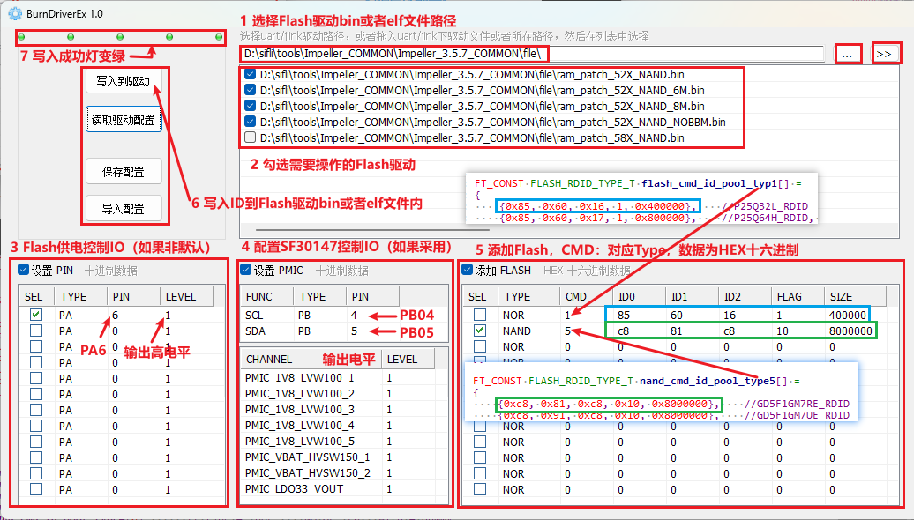<br>

#### 1.2.2 用新生成的驱动下载

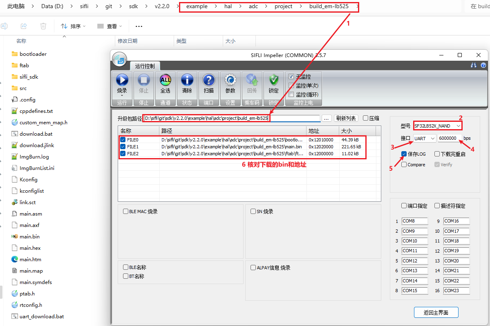<br>

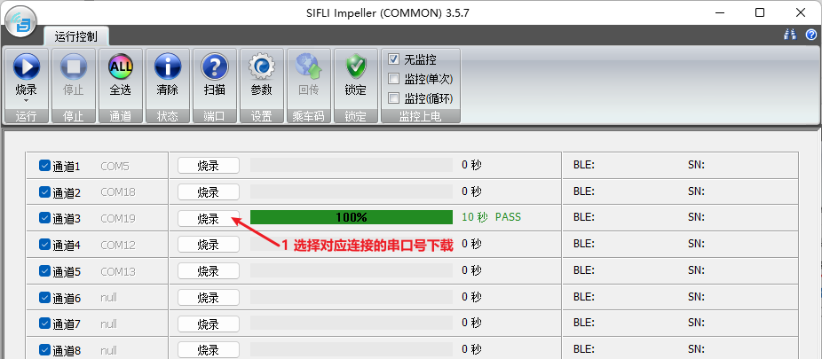<br>

#### 1.2.3 SDK代码Chipid添加到对应TYPE

生成的bin或者elf只是提供了Flash的下载，自身代码要读写该Flash，则需要在代码中添加对应的Chipid，再编译Bootloader和用户代码，自身代码才能跑起来

##### 1.2.3.1 Nor Flash添加方法

flash_table.c文件中，在对应的Type下面，添加上对应的Chipid

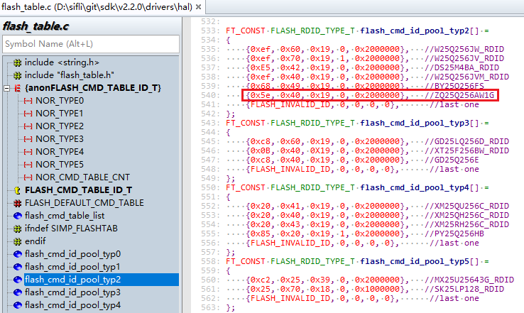<br>

##### 1.2.3.2 Nand Flash添加方法

nand_table.c文件中，在对应的Type下面，添加上对应的Chipid

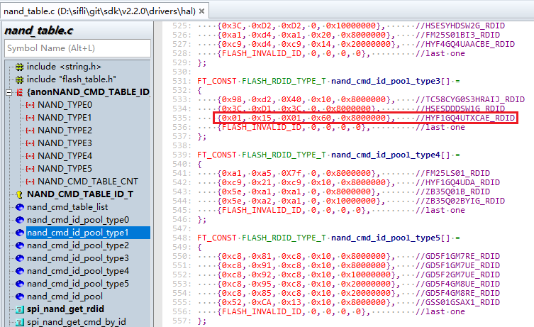<br>

## 2 查找ChipID方法

### 2.1 案例一GSS01GSAX1

以GSS01GSAX1-W8NMI0_Rev_1.1.pdf为例，打开后搜索flash读id通用命令：9fh，如下图，可以查看到9fh读id的时序图，和输出的chipid的顺序

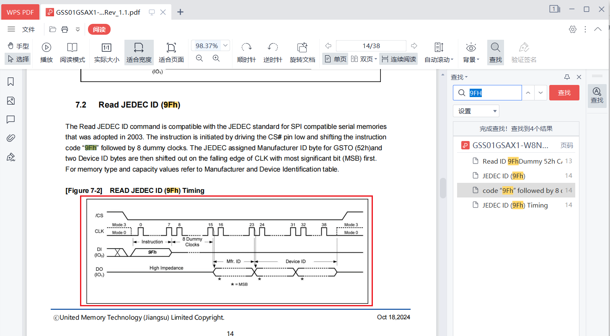<br>

下面是9fh命令能读到的ID，SPI发送9FH指令后，空8个clk的dummy，会输出0x52，0xca，0x13，

对应到nand_table.c文件的chipid表为：
{0x52, 0xCA, 0x13, 0x10, 0x8000000}, //GSS01GSAX1_RDID

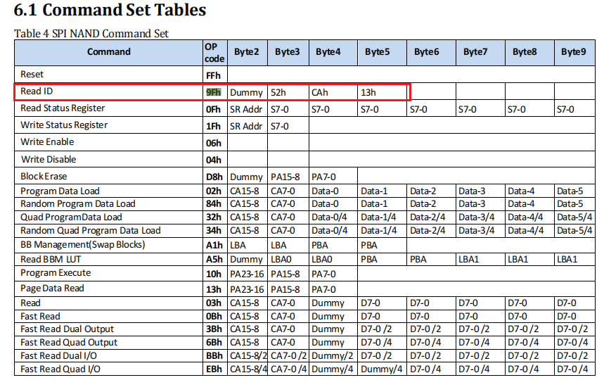<br>

### 2.2 案例二DS35X2GBXXX

东芯公司的这颗9Fh读chipid，在8bit clk的dummy后，只有2个byte chipid，软件默认还是会读3byte，chipid通常会循环发，如果读3个byte，下图1V8的型号，就会收到0xE5, 0xA2, 0XE5,同理如果读5个byte就会收到 0xE5, 0xA2, 0XE5, 0xE5, 0xA2,软件只取前3个byte作为chipid，得到该chipid为：
{0xE5, 0xA2, 0XE5, 0x22, 0x10000000}, //DS35M2GBXXX_RDID

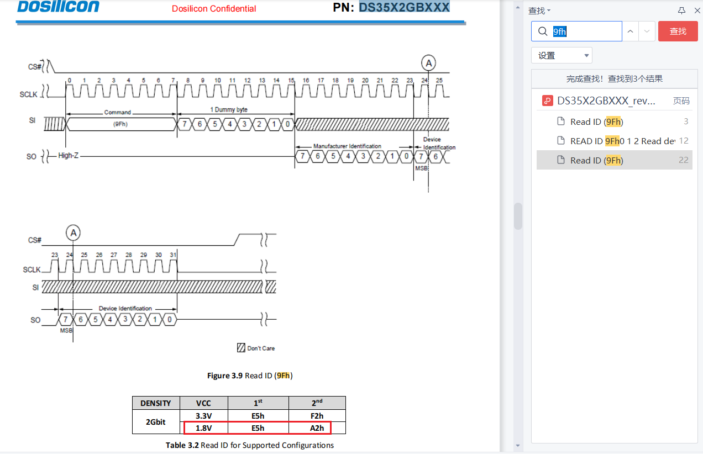<br>

### 2.3 通过下载打印Chipid

用Impeller.exe下载，查看log来查看Chipid，（这里只演示了uart下载获取chipid方法）

如下图：选择对应的CPU型号，uart/jlink，速率，nor/nand类别，对应下载地址正确后，返回主界面

<br>

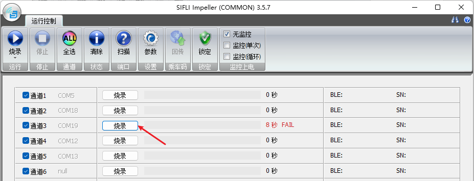<br>

点击烧录后，查看`Impeller_x.x.x_COMMON\log\channel\20xx_xx_xx\*.txt`刚下载失败过程生成的log，可以读取的Chipid为`{0xc8, 0x82, 0xc8, x, 0xxxxxxxxx},`

<br>

## 3 ChipID列表解释

### 3.1 Nor Flash

#### 3.1.1 ID解释
```c
typedef struct FLASH_FULL_CHIP_ID
{
    uint8_t manufacture_id; /* 厂家型号，同一个厂家都一样的，0x52代表 联和存储 */
    uint8_t memory_type;  /* 区分同一厂商的不同存储芯片型号 */
    uint8_t memory_density; /* 区分同一厂商的不同存储芯片型号 */
uint8_t ext_flags;    //8bit的意义，目前nor flash只用了bit 0，
// bit 0: nor flash，该bit为1，表示该flash支持DTR（QSPI双沿送数），0：表示不支持，这里置1后，用户代码是否采用DTR模式，由代码选择
    // bit 1: -  7  nor flash无意义，默认0
    uint32_t mem_size;  // flash 存储大小，单位（Byte）
} FLASH_RDID_TYPE_T;
```
**ID示例说明**

`{0x85, 0x20, 0x1a, 1, 0x4000000}, //PY25Q512HB_RDID`

`0x85：`代表Puya公司的芯片

`0x20：`代表内存类型

`0x1a：`代表内存设备ID

`1： `代表支持DTR双沿送数

### 3.2 Nand Flash
#### 3.2.1 ID解释
```c
typedef struct FLASH_FULL_CHIP_ID

{

uint8_t manufacture_id; /* 厂家型号，同一个厂家都一样的，0x52代表 联和存储 \*/

uint8_t memory_type; /* 区分同一厂商的不同存储芯片型号 \*/

uint8_t memory_density; /* 区分同一厂商的不同存储芯片型号 \*/

uint8_t ext_flags; //8bit的意义，目前nand flash只用了bit 1 – bit7，

// bit 0：Nand flash，该bit无意义，该bit 需要设置为0，

// bit 1: nand flash plane 标志位，1：两个plane；0：无双plane（常见）

// bit 2: nand flash page（页）大小标识位, 0： 为常见默认的每个page为2048；1：为每个page为4096

// bit 3: for NAND flash block（块）大小标识位, 0：为常见的每个block（块）为 64 pages（页）；1 ：为每个每个block（块）为 128 pages（页）

// bit 4~7: for NAND ECC status mode as NAND_ECC_MODE_T, 为ECC标识位

uint32_t mem_size; // flash 存储大小，单位（Byte）

} FLASH_RDID_TYPE_T;
```
**ID示例说明**

Ext_flags的8个bit的含有，比如：

`{0xE5, 0x74, 0xE5, 0x**2**2, 0x20000000}, //DS35X4GMXXX_RDID`

`0x22`的二进制为`0b0010 0010`

Bit4-7为0b0010，ECC标识位为2，

Bit3为0：每个block为64个page，

Bit2为0：每个page为2048个byte

Bit1为1：该Flash有2个plane

Bit0为0 ：无意义

#### 3.2.2 是否使用Plane

**NAND FLASH中plane的概念**

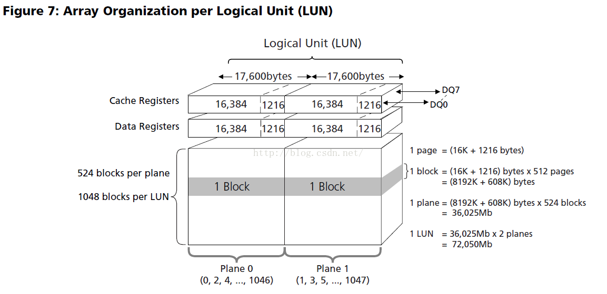<br>

NAND会利用多Plane设计以提升性能。如上图，一颗NAND分成2个plane，而且2个plane内的block是单双交叉编号的，并且我们可以对每个plane单独操作，实现ping-pong操作以提升性能。所以，我们引入interleave算法，interleave算法指的是，在单个channel下对多个plane进行访问，以提高NAND performance的算法。

#### 3.2.3 Page大小

NAND FLASH中page（页）block（块）的概念

Nand flash中page（页）是读写的最小单位，block（块）是擦除的最小单位。每个Nand地址精确到字节（地址编排）但依然以page为最小单位R/W（读写），操作要求page（页）对齐。

页（Page）：

页是 NAND Flash 存储器中的最小可编程单位，通常大小为 2KB、4KB 或 8KB。

写入数据时，需要先将整个页擦除为全 1，然后逐个字节或字写入数据。

读取数据时，可以按页或者按字节进行读取。

页是 NAND Flash 存储器中操作的基本单位，写入数据时必须按页的整数倍进行。

如下图: 一个page大小为2024(2K) + 64bytes，每个page后面多出来的64byte，通常用用于标识坏块和ECC校验用

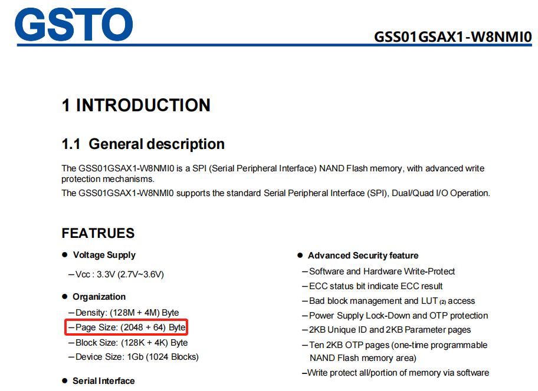<br>

#### 3.2.4 Block大小

块（Block）：

块是 NAND Flash 存储器中的最小擦除单元，通常包含多个页。

块的大小通常为 64KB、128KB 或 256KB，不同型号的 NAND Flash 存储器块大小可能会有所不同。

擦除操作是以块为单位进行的，即将整个块擦除为全 1。

一旦数据存储在一个块中，就无法直接对该块进行单个页的写入或擦除，必须先将整个块擦除后才能写入新数据。

如下图: 一个block大小为64个pages（共64x2K=128K Byte），
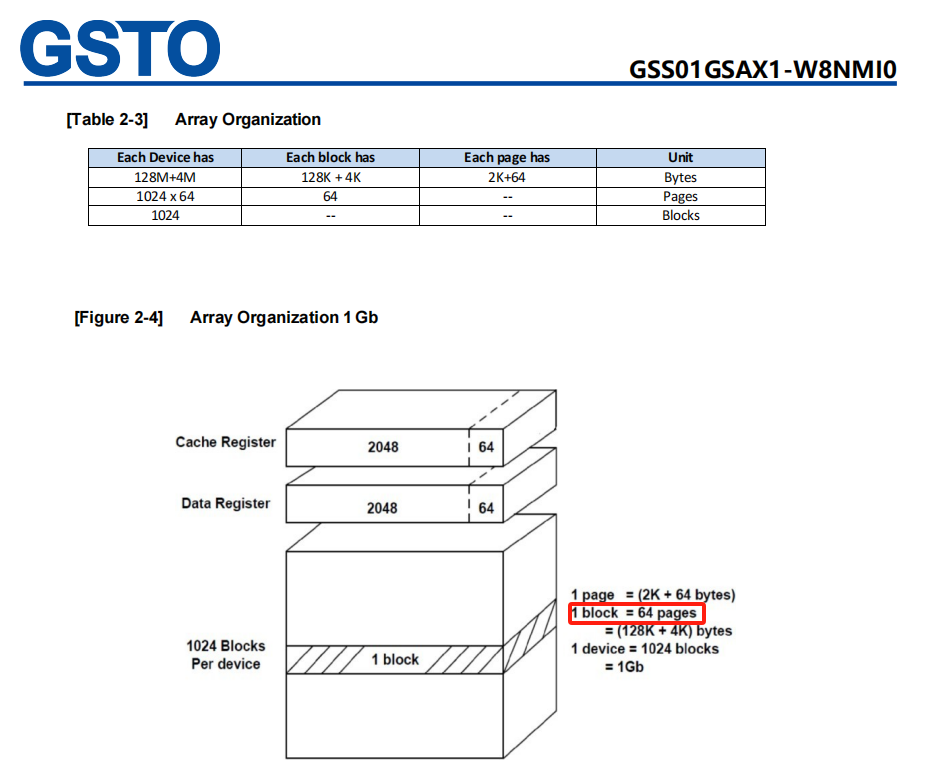<br>

参考文章：

NAND Flash 存储器通常以页（Page）和块（Block）的方式组织数据。以下是 NAND Flash 的页与块结构的简要介绍：
[原文链接](https://blog.csdn.net/gqd0757/article/details/140107931)：https://blog.csdn.net/gqd0757/article/details/140107931

在实际应用中，为了减少 NAND Flash 存储器的擦写次数并延长寿命，通常会使用嵌入式文件系统（比如 UBIFS、JFFS2、FlashDB 等）来管理 NAND Flash 存储器的页与块。坏块管理和这些文件系统会对数据进行合理分配和管理，减少擦写操作对 NAND Flash 存储器的影响。

也可以采用EMMC存储，EMMC存储就是已经包含Nand读写控制器和Nand flash，Nand控制器包含了坏块管理和擦写均匀操作。

#### 3.2.5 配置ECC参数

##### 3.2.5.1 NAND和ECC概念

NAND是一种非易失性存储器芯片，通常用于闪存存储器和SSD（固态硬盘）中。由于其高密度和低成本，NAND存储器广泛应用于各种设备中。然而，由于其物理特性，NAND存储器容易受到位翻转和数据丢失等问题的影响。

ECC（Error Correction Code，错误校正码）是一种用于检测和纠正数据传输中错误的编码技术。通过在数据中添加冗余信息，ECC可以帮助识别和纠正数据传输中的错误。常见的ECC算法包括海明码和BCH码等，这些算法可以检测和纠正多个位的错误。

##### 3.2.5.2 ECC原理

在NAND存储器中，ECC校验通常在存储器控制器硬件中实现。默认是打开的，当数据写入NAND存储器时，控制器会计算数据的ECC校验码，并将其与数据一起存储。当数据被读取时，控制器会再次计算ECC校验码，并将其与存储的校验码进行比较。如果发现差错，ECC校验码可以帮助控制器识别出错误的位，并尝试进行纠正；

##### 3.2.5.3 ECC状态寄存器

如下图Nand状态寄存器，

B0H寄存器bit4：ECC Enable位默认是打开的，

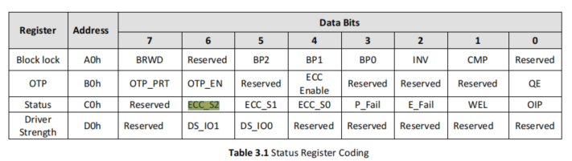<br>

C0H寄存器bit4-6（有些NAND是2bit或者4bit），是ECC状态状态寄存器

QSPI接口从IO读到的数据，是已经纠错过的数据，但读到的数据是否有效，还需要查看C0H寄存器的ECC状态寄存器（每次完整的read操作后，ECC状态寄存器都会更新），如果ECC状态寄存器提示超出ECC可纠正范围，该数据就需要丢弃掉，但是不同NAND的ECC状态寄存器C0H的bit4-6标识不一样，为了适应不同NAND,就需要进行选择。
```c
typedef enum __NAND_ECC_STATUS_MODE_

{

BIT2_IN_C0_T1 = 0, // 有2位状态位, bit 4-5：00： ECC无错误; 01：出现1位错误但ECC可纠正，其他：提示超过1bit的错误且不能被ECC纠正

BIT2_IN_C0_T2 = 1, // 有2位状态位, bit 4-5：00：ECC无错误，01或11：有错误但ECC可以纠正，10：有错误且ECC不能纠正

BIT3_IN_C0_T1 = 2, // 有3位状态位, bit4-6，000：无错误，001或011或101有错误但ECC可以纠正，010：有超过8bit错误且不能ECC纠正

BIT3_IN_C0_T2 = 3, //有3位状态位, bit4-6，000：无错误， 111：有错误且不能ECC纠正，其它：有错误但ECC可以纠正，

BIT4_IN_C0_T1 = 4, // 有4位状态位, bit4-7，0000：无错误， xx10：有错误且不能ECC纠正，其它：有错误但ECC可以纠正

BIT4_IN_C0_T2 = 5, // 有4位状态位, bit4-7，0000：无错误， 大于1000：有错误且不能ECC纠正，其它：有错误但ECC可以纠正

BIT2_IN_C0_T3 = 6 // 有2位状态位, bit 4-5：00：ECC无错误; 01：出现了1-2位错误但ECC可纠正，10：出现了1-2位错误但ECC可纠正，11：有错误且不能被ECC纠正

} NAND_ECC_MODE_T;
```
##### 3.2.5.4  ECC配置例1

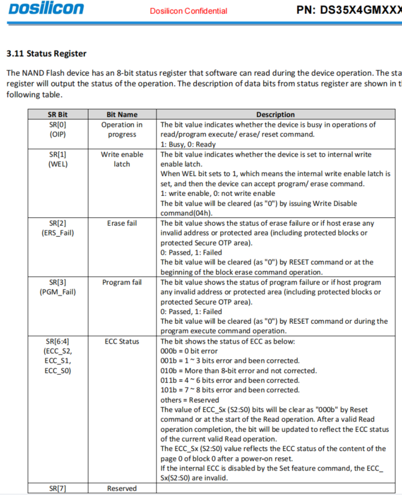<br>

`{0xE5, 0x74, 0xE5, 0x**2**2, 0x20000000}, //DS35X4GMXXX_RDID`

如上图，C0H有3个bit状态位ECC_S0-S2，符合2的描述（010有错误且不能纠正），ECC参数位在ext_flags中0x22,其中 bit4-7为2。

##### 3.2.5.5 ECC配置例2

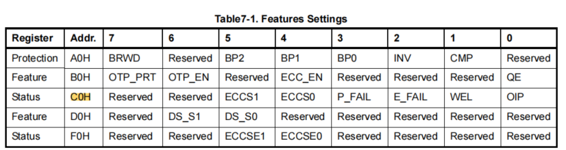<br>

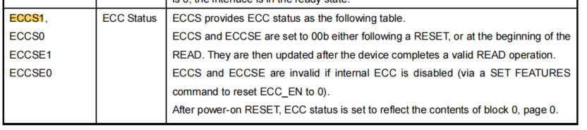<br>

`{0xc8, 0xd9, 0xc8, 0x**1**0, 0x8000000}, //GD5F1GQ4UxxH_RDID`

如上图，C0H有2个bit状态位ECCS0-S1（ECCSE0-1在F0H寄存器，代码没有处理），符合1的描述（10有错误且不能纠正），ECC参数位在ext_flags中0x10,其中 bit4-7为1。

##### 3.2.5.6  ECC配置例3

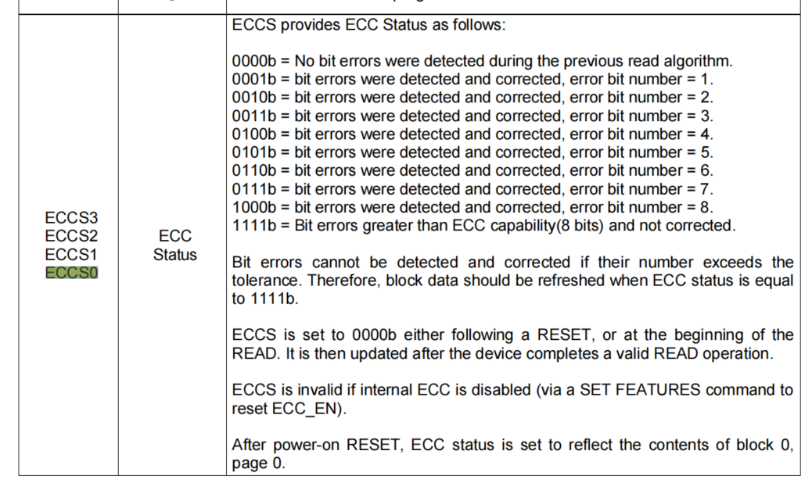<br>

`{0x0B, 0x11, 0X00, 0x**5**0, 0x8000000}, //XT26G01CXXX_RDID`

如上图，C0H有4个bit状态位`ECCS0-S3`，符合5的描述（大于1000：有错误且不能纠正），ECC参数位在`ext_flags`中0x50,其中 bit4-7为5。

## 4 Flash Type选择

### 4.1 Nor Flash

#### 4.1.1 DTR概念

Flash DTR模式是`Dual Transfer Rate`（双传输速率）的缩写，意味着在时钟信号SCK的双边沿均触发数据传输，可以提高传输效率。DTR模式与`Double Data Rate（DDR）`模式类似，都是双边沿触发，但DDR通常指代的是数据传输速率，而DTR则更侧重于传输速率的概念，

**是否支持DTR功能**

**如下图，搜索EDh，如果能看到如下的DTR 4线IO读命令，表示支持**
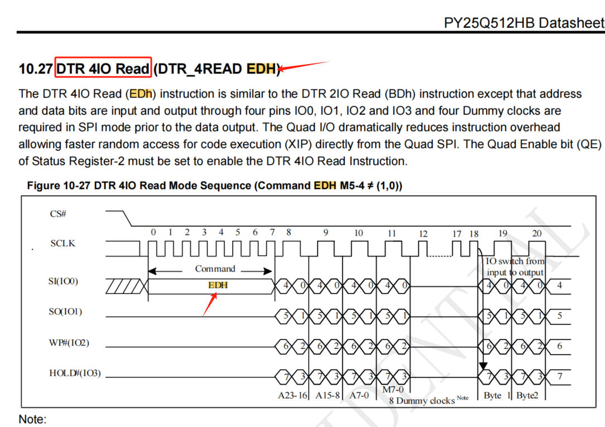<br>

#### 4.1.2 QE标志位概念

QE bit（Quad Enable bit）是Quad Enable的缩写，串行NOR Flash中的一个重要概念，中文称为四线使能。在串行NOR Flash中，QE bit用于控制引脚的功能复用。具体来说，QE bit决定了Pin3和Pin7的功能：当QE bit使能时，这些引脚用于数据传输；当QE bit不使能时，这些引脚则用于WP#（写保护）、HOLD#（保持）等控制功能。

#### 4.1.3 WRSR2寄存器

WRSR2寄存器是**WR**ite **S**tatus **R**egister 2缩写，不同Nor读写 WRSR2寄存器的方式分为两种，如下：

**Type0** 没有单独31h来写WRSR2寄存器（少数）

采用01H写2个byte的方法来写WRSR2寄存器，如下图

<br>

**Type1** 有单独的31H来写WRSR2寄存器（占大多数）

**备注**：一部分支持31H命令的Nor也支持01H连续写2个byte的方式操作WRSR2，因此放在Type0或Tpye1都可以；

Datasheet查找方法，搜索31H命令，如果没有31H命令就只能放在Type0，

如下图type0和type1的区别就只有31H命令
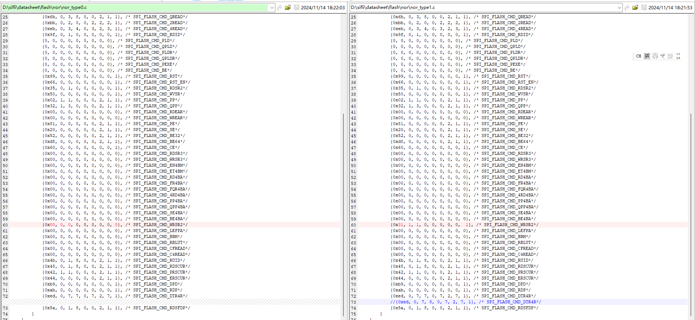<br>

如下图BY25Q256FS这颗 01H支持连续写S15-S8（即WRSR2），31H也支持单独写S15-8，放在Type0或Tpye0都可以；

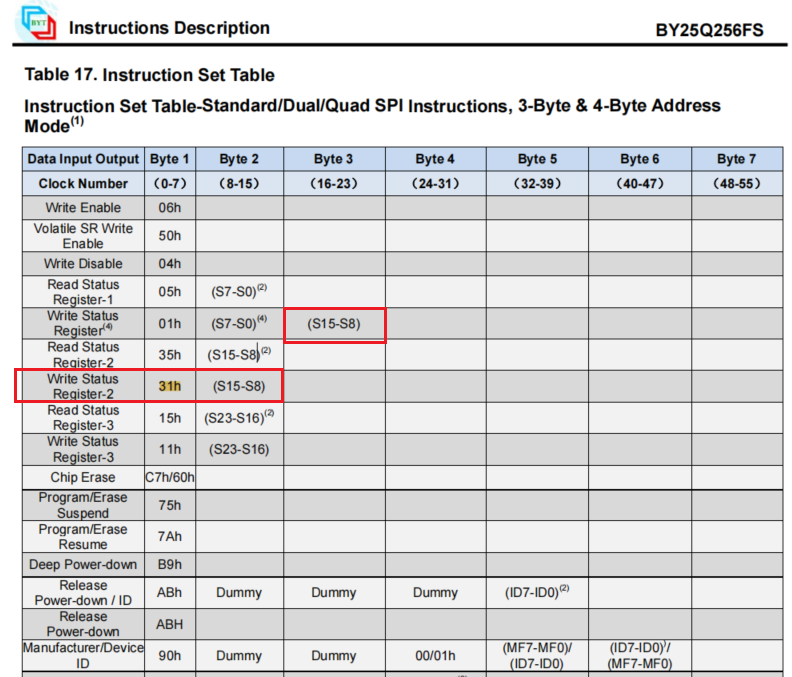<br>

#### 4.1.4 读OTP的地址MODE

TYPE选择中，有提到OTP的命令3byte还是4byte问题，这里做一个简单介绍

Nor通常提供了大约256byte的Security Registers.寄存器（俗称OTP(One Time Program)区），这个区域其实是可以多次擦写的，但是也能配置为OTP保护起来，用于存储安全或者重要信息，比如蓝牙（网络）地址，设备名，序列号，支付宝加密等信息，

在大于128Mbit的nor中，读写也有3byte还是4byte的命令差异（程序中对应命令：SPI_FLASH_CMD_RDSCUR ），如下图：

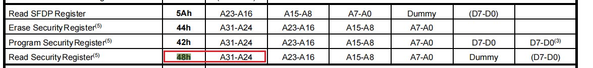<br>

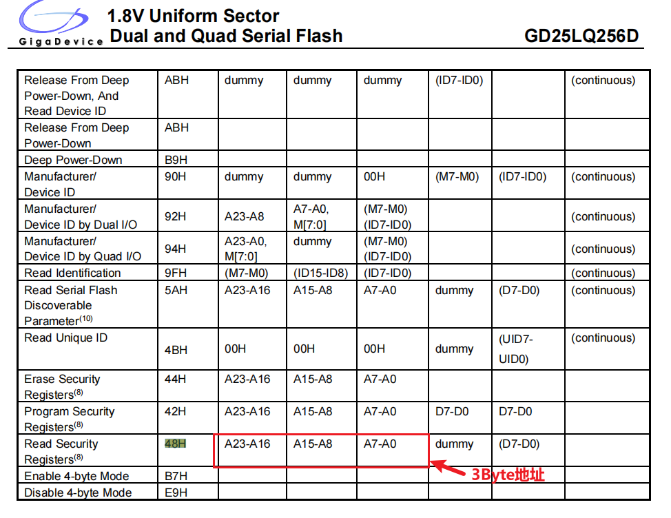<br>

#### 4.1.5 NOR之4字节地址模式

**背景**

容量低于16MB（128Mbit） bytes的 nor，一般使用 3 字节地址模式，即命令格式是cmd + addr[2] + addr[1] + addr[0] + ...

使用超过16M bytes 的 nor flash，则需要 4 字节地址模式， 即命令格式是 cmd + addr[3] + addr[2] + addr[1] + addr[0] + ...

**原因**

为什么呢, 因为用 3 个字节表示地址，则其范围是 0x000000 - 0xffffff = 0 - 16M，超过 16M 的地址就无法表示了，那自然就得上 4 字节了，而4字节就能支持从256Mbit到32Gbit了，

**3字节4字节切换问题**

超过128Mbit的flash为了兼容原有MCU boot ROM代码，芯片出厂默认是3字节模式(可访问128Mbit内的内容)，然后通过发送B7h命令进入4字节模式，发送E9h也能退出4字节模式。

**有无4字节模式命令6Ch**

**有些nor厂商，并没有6Ch专门的4四节地址命令，在3字节地址模式下，用6Bh，四字节地址下还是用6Bh命令，这样命令就会有差异，TYPE就会不一样，如下**

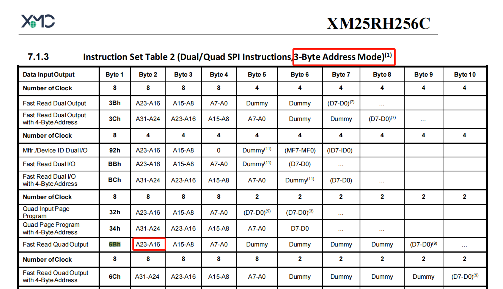<br>

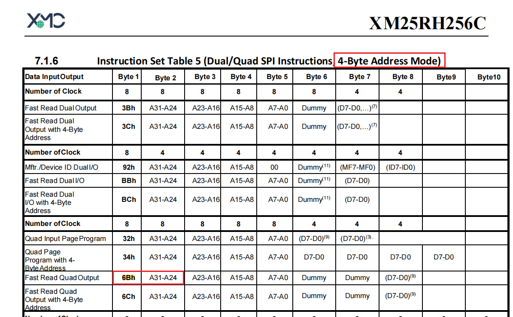<br>

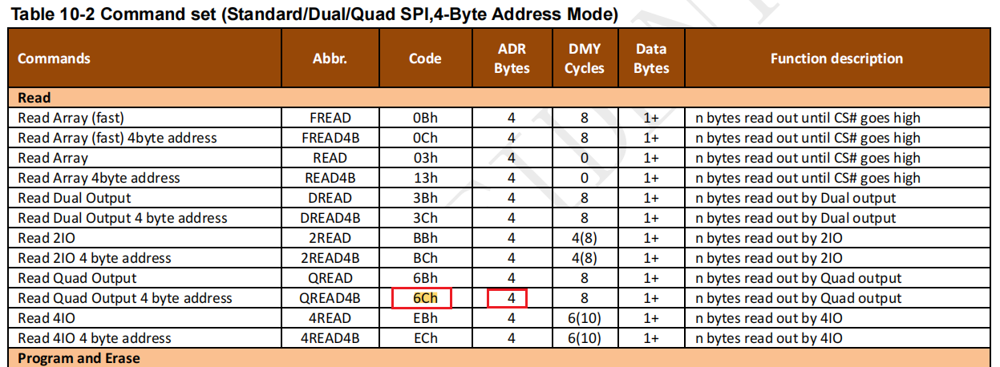<br>

#### 4.1.6 每个TYPE的介绍
```c
typedef enum

{

NOR_TYPE0 = 0, // normal type 0, DTR, NO CMD_WRSR2, Max 128Mb, as default command table

NOR_TYPE1, // type 1, WRSR2 to write status register 2(QE), Max 128Mb

NOR_TYPE2, // type 2, 256Mb, DTR, 4 bytes address command diff with 3 bytes, OTP support 4-B mode

NOR_TYPE3, // type 3, 256Mb , NO DTR , 4 bytes command same to 3 bytes, only timing changed, OTP 3-B only

NOR_TYPE4, // type 4, 256Mb, NO DTR, 4B ADDR command diff with 3B addr , OTP support 4-B mode

NOR_TYPE5, // type 5, 256Mb, NO DTR, MXIC flash have too many diff with others

NOR_CMD_TABLE_CNT

} FLASH_CMD_TABLE_ID_T;
```
| NOR_TYPE0 | 128Mbit以及以下，支持DTR,无31h命令写WRSR2寄存器 |
| --- | --- |
| NOR_TYPE1 | 128Mbit以及以下，支持DTR，有31h命令写WRSR2寄存器 |
| NOR_TYPE2 | 256Mbit以及以上，支持DTR, 有单独的6Ch命令来4字节操作, OTP 支持 4Byte地址访问 |
| NOR_TYPE3 | 256Mbit以及以上，不支持DTR, 无单独的6Ch命令来4字节操作,3字节或4字节地址都由6Bh命令来操作，OTP 只支持 3Byte地址访问 |
| NOR_TYPE4 | 256Mbit以及以上，不支持DTR, 有单独的6Ch命令来4字节操作, OTP 支持 4Byte地址访问 |
| NOR_TYPE5 | 256Mbit以及以上，不支持DTR, MXIC flash这个TYPE差异比较大 |

#### 4.1.7 TYPE选择流程图

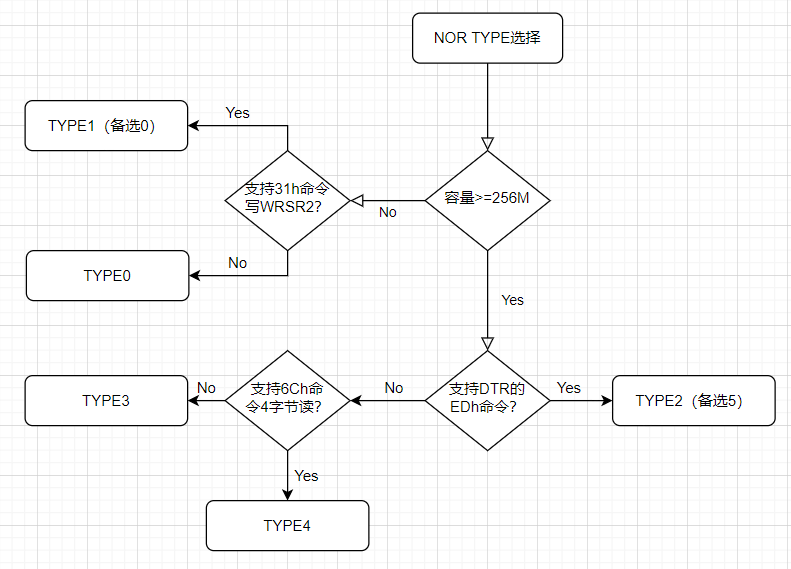<br>

### 4.2 Nand Flash

#### 4.2.1 QE标志位概念

QE bit（Quad Enable bit）是Quad Enable的缩写，串行NOR Flash中的一个重要概念，中文称为四线使能。在串行NOR Flash中，QE bit用于控制引脚的功能复用。具体来说，QE bit决定了Pin3和Pin7的功能：当QE bit使能时，这些引脚用于数据传输；当QE bit不使能时，这些引脚则用于WP#（写保护）、HOLD#（保持）等控制功能**。**

很多NAND默认只支持4线模式，并没有QE标注位，不需要从单线切四线的动作，

**QE标志位怎么查**

直接datasheet搜索QE，或者搜索B0h（有些nand叫做Bxh寄存器）特征寄存器，查看是否存在QE标志位，如下图，就是带QE标志位，请选择带QE标志位的TYPE，如果搜索不到就是不需要QE切换

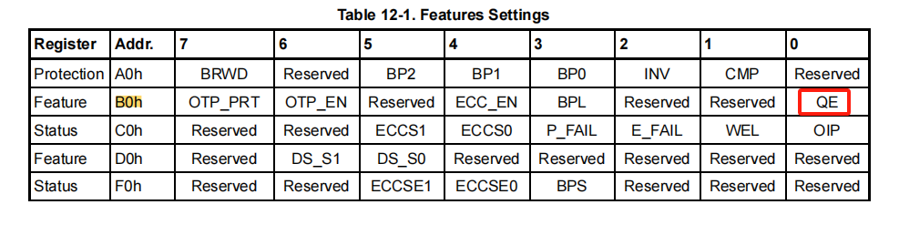<br>

#### 4.2.2 EBh命令概念

EBh和6Bh都是快速4线读命令，差异在于EBh命令送的page地址也是4线方式，会更快，不过有些NAND并不支持，如下是6Bh命令，可以直接datasheet搜索EBh命令，如果没有，就是不支持

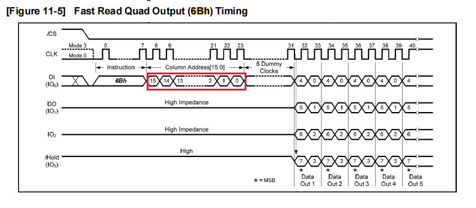<br>

在TYPE判别的时候，会看EBh这个指令后面的有几个dummy，这里介绍如何区分：

4个Dummy方式如下图，在发完16bit的page地址后，紧跟的4个Dummy时钟，

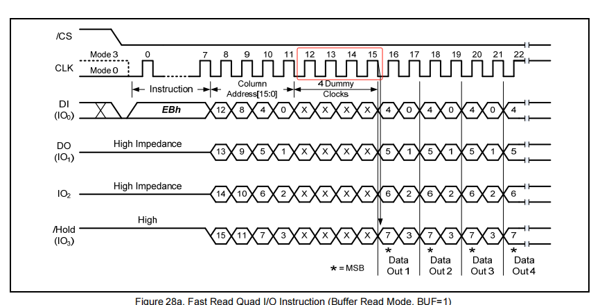<br>

2个Dummy方式如下图：发完16个bit的page地址后只跟了2个dummy时钟

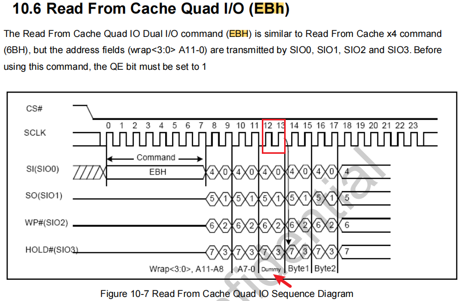<br>

#### 4.2.3 NAND连续的概念

Nand buff读和连续读的概念，如下图，这颗支持buffer read和continuous read方式

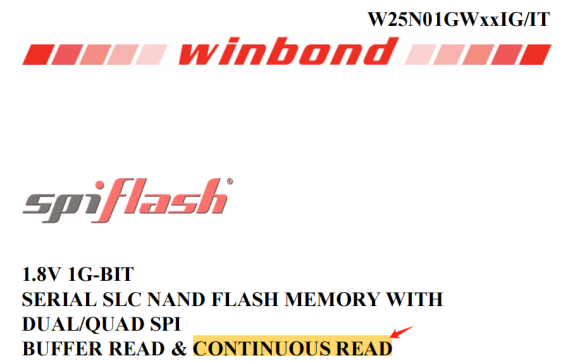<br>

**Buff读的概念**

在从QSPI NAND中读数据时，是需要分为两步

第一步Page Data Read (13h)，将数据从cell中读取到data buffer中。此时nand会读取cell数据，并计算ecc，进行纠错。如果cell中发生了位翻转，那么经过ecc纠错后写到data buffer中的就已经是正确的数据了

第二步，Read Data (6Bh或EBh)，将数据从data buffer中读出来。

可以看到，data buffer是读写的必经之路。

**连续读的概念**

Buff读只能一个命令读一个page，读下一个page则需继续上面两步，

这时有些Nand公司推出了连续读，

当BUF=0标志位为0时，设备处于连续读取模式，数据输出

将从data buffer的第一个字节开始，并自动递增到下一个更高的地址。当一个page的data buffer读完后，下一个page的第一个字节的数据将紧随其后继续输出下一个page的数据，直到读完整个NAND。因此可以达到使用单个读指令读取整个NAND,

判读是否支持连续读功能，可以搜索 Continuous Read，或者查看6Bh命令，是否有如下图这样的表述，BUF=1(该标志位是表示是否使用连续读功能)

<br>

#### 4.2.4 每个TPYE介绍
```c
typedef enum

{

NAND_TYPE0 = 0, // normal type, base on winbond w25n01gw, with NON-BUF, NO QE, EB with 4 dummy

NAND_TYPE1, // based on XT26G01D, BUF, QE, EB, EB with 2 dummy

NAND_TYPE2, // based on ds35x1gaxxx, BUF , QE, NO EB

NAND_TYPE3, // based on tc58cyg0s3hraij, BUF, NO QE, NO EB

NAND_TYPE4, // based on FM25LS01, BUF, NO QE, EB with 4 dummy

NAND_TYPE5, // based on GD5F1GM7RE, BUF, QE, EB, EB with 4 dummy

NAND_CMD_TABLE_CNT

} NAND_CMD_TABLE_ID_T;
```
| NAND_TYPE0 | 支持连续读模式，没有QE标志位，EBh命令后面跟4个空dummy时钟 |
| --- | --- |
| NAND_TYPE1 | 带QE标志位，EBh命令后面跟2个空dummy时钟 |
| NAND_TYPE2 | 带QE标志位，无EBh命令 |
| NAND_TYPE3 | 无QE标志位，无EBh命令 |
| NAND_TYPE4 | 无QE标志位，EBh命令后面跟4个空dummy时钟 |
| NAND_TYPE5 | 带QE标志位，EBh命令后面跟4个空dummy时钟 |

#### 4.2.5 TYPE选择流程图

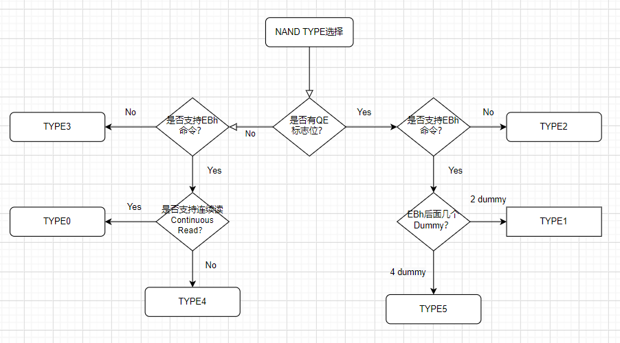<br>

## 5 常见问题

### 5.1 Flash下载的原理

#### 5.1.1 Uart下载

通过Uart接口，把对应的Flash烧录bin，比如ram_patch_52X_NAND.bin加载52这颗MCU的RAM中指定地址，然后跳转到该RAM地址，再执行烧录外部Nor或者Nand Flash的操作代码。

#### 5.1.12 Jlink下载

当Jlink通过SWD接口连接上MCU，并命令行执行：

Loadbin d:\1.bin 0x62000000这个命令时，Jlink.exe会从JLinkDevices.xml配置里面根据对应的0x62000000地址，选择Devices/SiFli/SF32LB52X_EXT_NAND2.elf加载到52这颗MCU的RAM中，调用elf文件中对应的烧录接口进行烧录。

<br>

### 5.2 Uart下载过程Log分析

#### 5.2.1 ChipID读不到

如下图用Impeller.exe下载，查看log来查看Chipid，（这里只演示了uart下载获取chipid方法），发现Chipid读不到

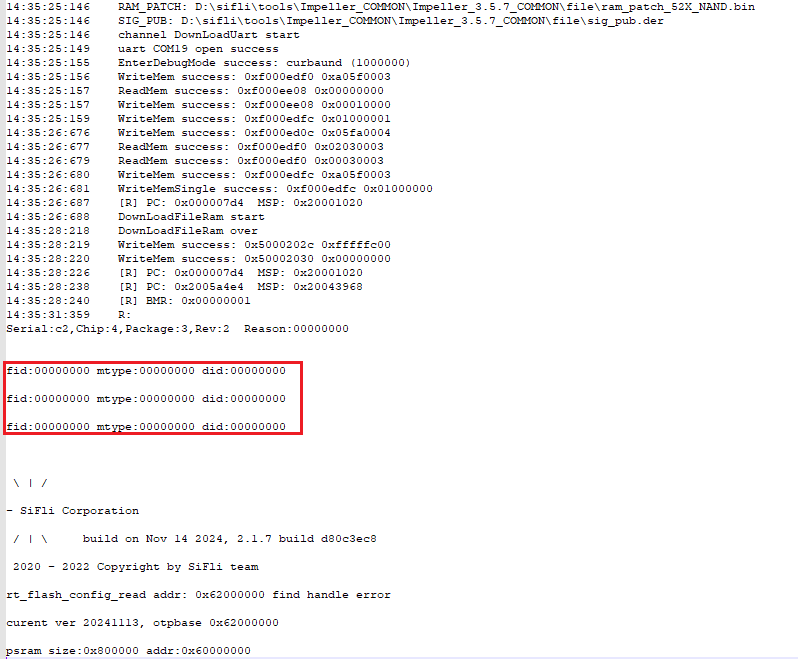<br>

**常见原因：**

1. Flash供电没有或者供电电压不符，特别留意1.8V和3.3V两种Flash的差异
2. Flash焊接不良或者焊反了
3. 烧录失败后，测量Flash的供电没有的话，排除硬件问题后，常见就是烧录驱动中Flash的供电没有打开，需要在生成工具中配置对应的Flash供电打开方式（如果供电不是默认供电的话），

#### 5.2.2 烧录BIN没有跑起来

见5.1章节Flash的烧录原理介绍

见下面的打印
```
16:18:48:151 uart COM19 open success //这个提示表示下载的串口19打开成功了，

16:18:54:499 DownLoadUart() fail //这个表示烧录BIN，没有通过Uart成功下载到MCU的RAM中运行起来

16:18:54:499 FINAL_FAIL 500bf
```
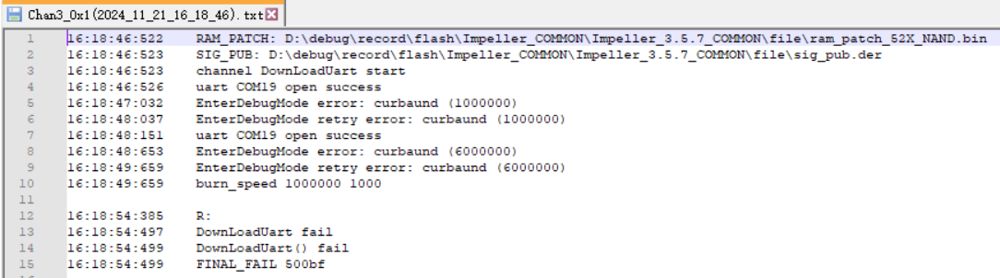<br>

**常见原因：**

1. MCU供电异常，MCU没有跑起来
2. MCU跑在用户程序中，但是对应的Uart口或者Jlink不同或者MCU死机

解决方案：

让MCU进入Boot模式，串口上确认看到了进入Boot模式的打印

1）55，56，58系列MCU，有专门的Boot_Mode脚，拉高后进入boot模式的打印如下：

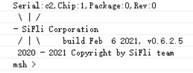<br>

2）52系列芯片，没有专门的Boot_Mode脚，在上电后3秒输入命令，可以进入boot模式，对应的打印如下：

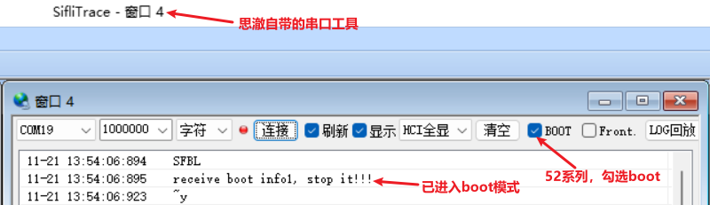<br>

#### 5.2.3 Log提示校验失败

如下的Log
```
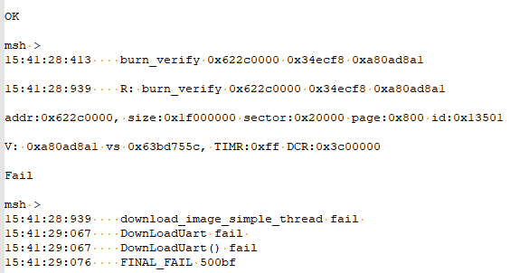<br>

15:41:28:413 burn_verify 0x622c0000 0x34ecf8 0xa80ad8a1

15:41:28:939 R: burn_verify 0x622c0000 0x34ecf8 0xa80ad8a1

addr:0x622c0000, size:0x1f000000 sector:0x20000 page:0x800 id:0x13501

V: 0xa80ad8a1 vs 0x63bd755c, TIMR:0xff DCR:0x3c00000

Fail
```
**常见原因**

1. 芯片D2-D3焊接不良
2. QSPI的走线太长或者飞线导致的干扰导致个别bit错误

#### 5.2.4 Uart串口端收到乱码

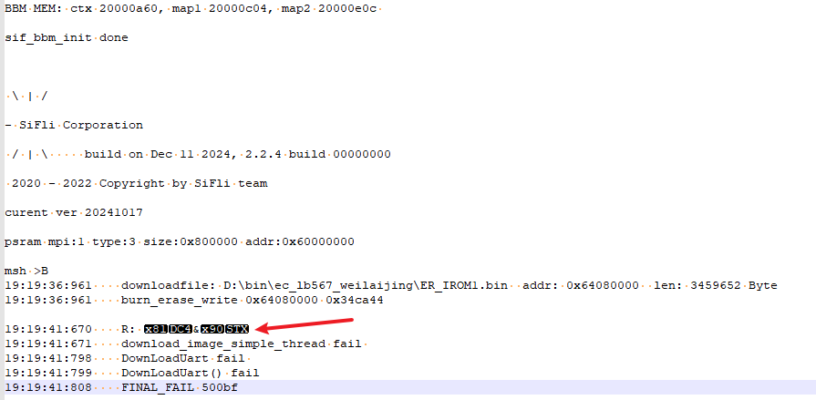<br>
```
msh >B

19:19:36:961 downloadfile: D:\bin\ec_lb567_weilaijing\ER_IROM1.bin addr: 0x64080000 len: 3459652 Byte

19:19:36:961 burn_erase_write 0x64080000 0x34ca44

19:19:41:670 R: ?&?

19:19:41:671 download_image_simple_thread fail

19:19:41:798 DownLoadUart fail

19:19:41:799 DownLoadUart() fail

19:19:41:808 FINAL_FAIL 500bf
```
如上图：下载过程RX收到乱码

**常见原因**

1）下载过程中机器出现重启

### 5.3 QSPI Flash频率问题

默认Flash读写QSPI CLK的频率推荐为60Mhz左右，有些Nor/Nand规格书上写的支持频率到108Mhz以及以上，频率高，优点是数据读写加快，缺点是对PCB走线要求高，也会带来更多的EMI干扰，尤其是SDK代码打开DRT双沿CLK采样后，对走线要求更高。

修改Flash CLK的方法，通常在对应项目的bsp_init.c文件HAL_PreInit函数内，取决于Flash连接的哪个MPI接口，时钟源用的哪个，分频系数为多少，如下，如果要提高，就是把mpi2_div从5改成4，即变成了288Mhz/4 = 72Mhz，修改后，也可以通过串口命令sysinfo来查看CLK时钟变化
```c
HAL_RCC_HCPU_EnableDLL2(288000000);

mpi2_div = **5**;

HAL_RCC_HCPU_ClockSelect(RCC_CLK_MOD_FLASH2, RCC_CLK_FLASH_DLL2);
```
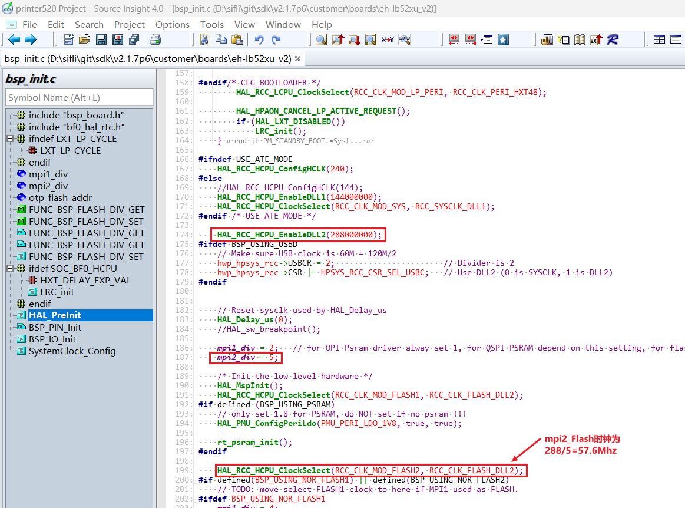<br>

### 5.4 Nand Page/Block问题

章节3.2.2和3.2.3中有提到大容量的Nand的Page和Block也有增大的趋势，在APP应用程序上对Flash进行管理时，也要考虑对应Page/Block的操作方法。