# 566添加DPI-LCD实例
## 1 确认rt-driver工程正常运行
调屏推荐采用rt-driver工程，调试前确认rt-driver工程能正常运行并有Log打印
### 1.1 编译
进入`example\rt_driver\project`目录，右键选择`ComEmu_Here`弹出编译命令串口，依次执行<br>
```
>  D:\sifli\git\sdk\v2.2.6\set_env.bat   #设置编译环境路径
> scons --board=em-lb566 -j8  #指定em-lb566模块编译rt-driver工程
```
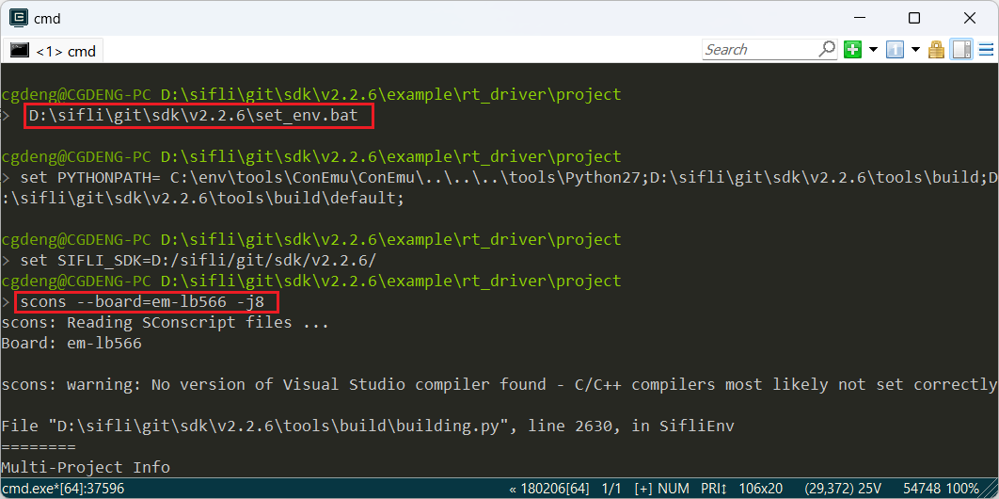<br>
### 1.2 进入BOOT模式
BOOT_MODE拉高到3.3V，566进入`boot`模式便于下载，如下图的BOOT_MODE短接拉高到3.3V<br>
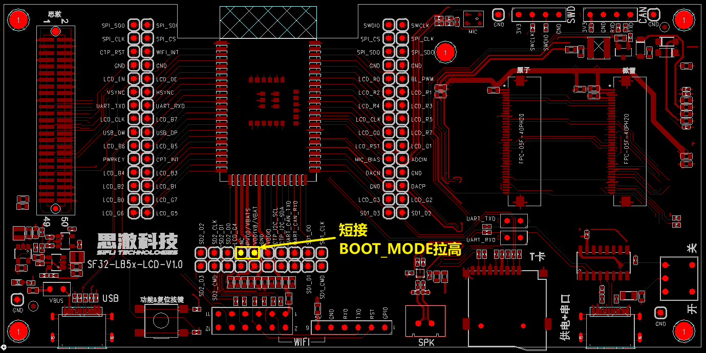<br>
进入boot模式后，串口会有如下Log输出，命令输入`help`,也会有Log输出，代表串口MCU运行正常，串口通讯正常，点击断开串口，准备进行下载<br>
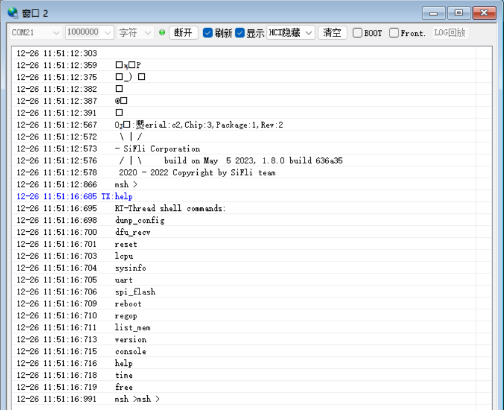<br>
### 1.3 下载
```
> build_em-lb566\uart_download.bat

     Uart Download

please input the serial port num:21 #然后选择1.2步骤中验证可以输出Log的串口号进行下载 
```
### 1.4 确认正常LOG
去掉步骤1.2时的短接跳线，上电复位，让MCU跑用户程序，如果输出如下Log，表示开发板已经正常运行，接下去就可以继续下一步添加新屏幕模组<br>
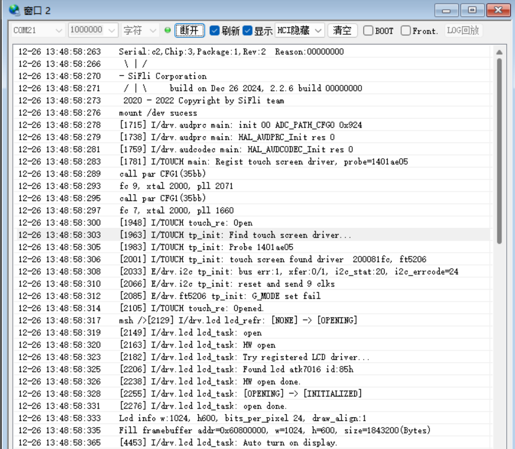
## 2 添加屏驱NV3052C
### 2.1 创建NV3052C驱动
1） 屏驱位置<br>
屏驱动位于`sdk\customer\peripherals`目录<br>
2） 复制驱动<br>
复制一份其他`dpi`接口的驱动更名为`dpi_nv3052c`<br>
### 2.2 Menuconfig添加NV3052C
1） 修改Kconfig在menuconfig中生成该屏的选项<br>
文本编辑器打开sdk\customer\boards\Kconfig_lcd，添加一个DPI屏的选项和分辨率，如下<br>
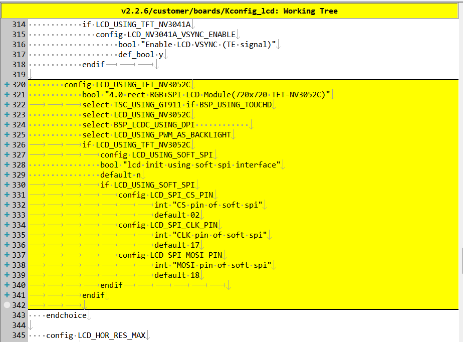<br>
```
# menuconfig 生成菜单呈现的选项
        config LCD_USING_TFT_NV3052C
            bool "4.0 rect RGB+SPI LCD Module(720x720 TFT-NV3052C)"     #menuconfig中显示的字符
			select TSC_USING_GT911 if BSP_USING_TOUCHD      #如果有TP可以打开，对应TP的驱动是否编译依赖此宏
            select LCD_USING_NV3052C        #spi_nv3052c文件夹内文件是否的编译依赖于此宏
            select BSP_LCDC_USING_DPI       #选择DPI接口      
            select LCD_USING_PWM_AS_BACKLIGHT #是否打开屏的PWM背光，有背光的屏需要打开
			if LCD_USING_TFT_NV3052C
				config LCD_USING_SOFT_SPI #选择DPI屏是否需要SPI进行初始化
                bool "lcd init using soft spi interface" #menuconfig中显示的字符
                default n
				if LCD_USING_SOFT_SPI
					config LCD_SPI_CS_PIN # 软件SPI中CS脚
							int "CS pin of soft spi" #menuconfig中显示的字符
							default 02 #默认PA02
					config LCD_SPI_CLK_PIN  # 软件SPI中CLK脚
							int "CLK pin of soft spi" #menuconfig中显示的字符
							default 17 #默认PA17,如果PB口+96,例如PB02这里配置为98
					config LCD_SPI_MOSI_PIN # 软件SPI中MOSI脚
							int "MOSI pin of soft spi" #menuconfig中显示的字符
							default 18 #默认PA18
				endif						
			endif
# LCD_HOR_RES_MAX 配置为该屏的水平分辨率 
        default 720 if LCD_USING_TFT_NV3052C
# LCD_VER_RES_MAX 配置为该屏的垂直分辨率        
        default 720 if LCD_USING_TFT_NV3052C
# LCD_DPI 像素密度，为屏一英寸多少个像素点，不知道就填默认315
        default 315 if LCD_USING_TFT_NV3052C
```
2） LCD_USING_NV3052C添加<br>
文本编辑器打开文件`sdk\customer\peripherals\Kconfig`，添加如下<br>
```
config LCD_USING_NV3052C #添加该配置，Kconfig中才能select上
    bool
    default n
```
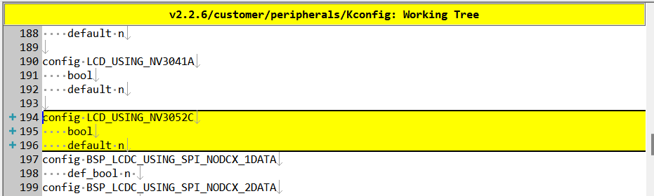<br>
3） SConscript修改<br>
文本编辑器打开文件`customer\peripherals\dpi_nv3052c\SConscript`，修改宏`LCD_USING_NV3052C`,这样该目录下的*.c和*.h文件就能加入编译<br>
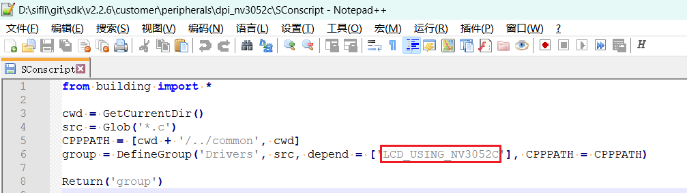<br>
### 2.3 Menuconfig选中NV3052C
以上步骤完成后，编译窗口输入下面命令，并选中刚添加的nv3052c屏<br>
> `menuconfig --board=em-lb566` （打开menuconfig窗口）
在这个路径下`(Top) → Config LCD on board → Enable LCD on the board → Select LCD`选中刚添加的屏，示例如下，如果该DPI屏有SPI接口需要初始化，才选中`lcd init using soft spi interface`,并配置好SPI所用的三个IO口，保存退出后，则选中了dpi_nv3052c目录下屏驱动参加编译<br>
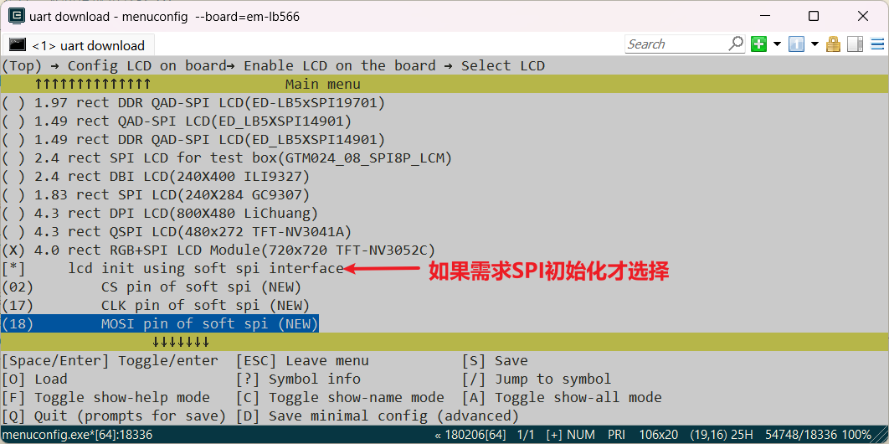<br>
## 3 生成SourceInsight工程  
为了便于查看参加编译的代码，可以生成rt-driver整个工程参加编译的文件list，再导入到Source Insight中便于查看，可以跳过此章节
### 1 生成文件List
命令`scons --board=em-lb566 --target=si`生成`si_filelist.txt`<br>
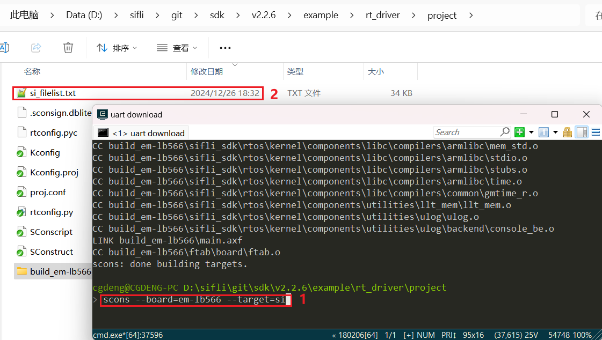<br>
### 2 文件List导入
打开Source Insight导入`si_filelist.txt`进入工程<br>  
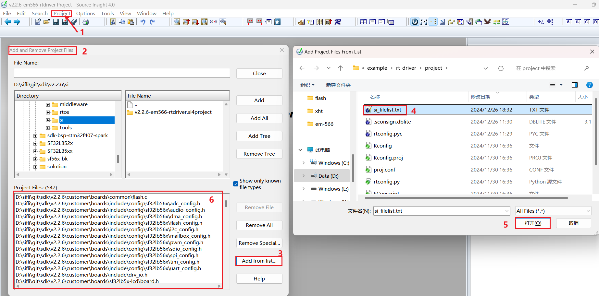<br>
### 3 查看屏驱是否生效
可以在SI（Source Insight）工程中查看`rtconfig.h`对应宏是否生成和是否已经包含了`dpi_nv3052c.c`加入编译  
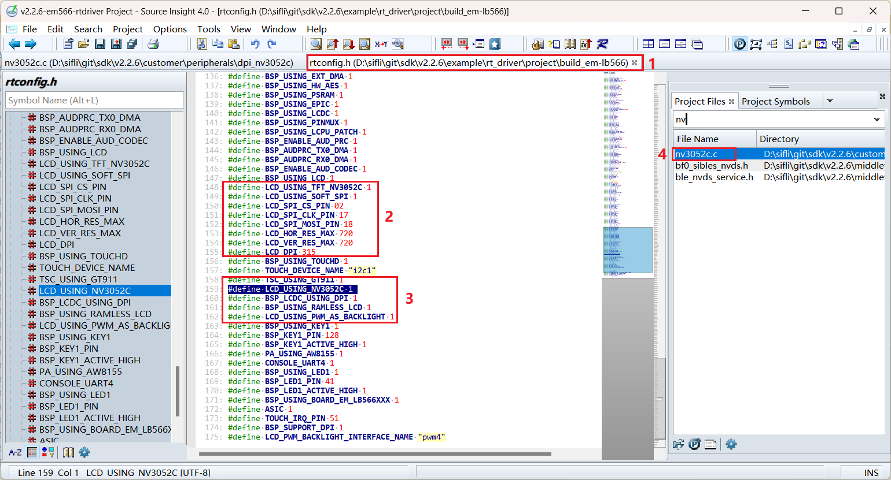<br>
## 4 屏硬件连接
### 4.1 排线连接
如果购买的是匹配的屏幕模组，直接排线连接到插座即可<br>
### 4.2 飞线连接
如果新的屏幕模组，排线排列不一致，就需要自己设计排线转接板或者从插针飞线调试。  
转接板的设计可以参考[SF32LB52-DevKit-LCD转接板制作指南](../../sf32lb52x/SF32LB52-DevKit-LCD-Adapter.md)  
## 5 屏驱动配置
### 5.1 默认IO配置
如果采用的默认IO，此处可以跳过
#### 5.1.1 IO模式设置
LCD采用的是LCDC1硬件来输出波形，需配置为对应的FUNC模式，<br>
每个IO有哪些Funtion可以参考硬件文档 [下载SF32LB56X_Pin_config](./assets/SF32_LB56_MOD_pinconfig_20240717.xlsx)<br>
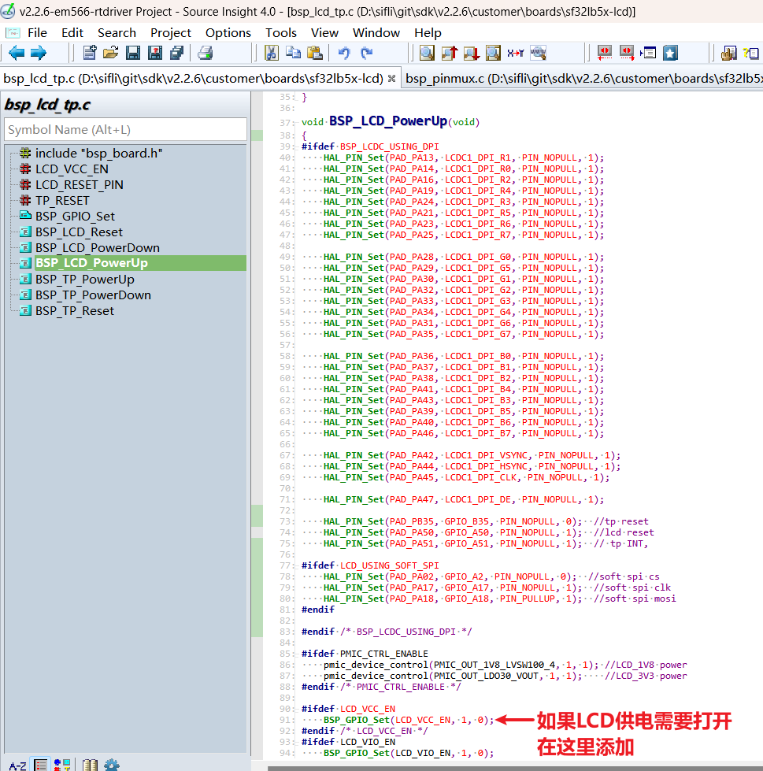<br>
LCD和TP的RESET脚都是采用GPIO模式，则默认已经配置为GPIO模式，如果LCD供电需要单独打开，也需要在这里打开
```c
void BSP_LCD_PowerUp(void)
{
#ifdef BSP_LCDC_USING_DPI
    HAL_PIN_Set(PAD_PA13, LCDC1_DPI_R1, PIN_NOPULL, 1);
    HAL_PIN_Set(PAD_PA14, LCDC1_DPI_R0, PIN_NOPULL, 1);
    HAL_PIN_Set(PAD_PA16, LCDC1_DPI_R2, PIN_NOPULL, 1);
    HAL_PIN_Set(PAD_PA19, LCDC1_DPI_R4, PIN_NOPULL, 1);
    HAL_PIN_Set(PAD_PA24, LCDC1_DPI_R3, PIN_NOPULL, 1);
    HAL_PIN_Set(PAD_PA21, LCDC1_DPI_R5, PIN_NOPULL, 1);
    HAL_PIN_Set(PAD_PA23, LCDC1_DPI_R6, PIN_NOPULL, 1);
    HAL_PIN_Set(PAD_PA25, LCDC1_DPI_R7, PIN_NOPULL, 1);

    HAL_PIN_Set(PAD_PA28, LCDC1_DPI_G0, PIN_NOPULL, 1);
    HAL_PIN_Set(PAD_PA29, LCDC1_DPI_G5, PIN_NOPULL, 1);
    HAL_PIN_Set(PAD_PA30, LCDC1_DPI_G1, PIN_NOPULL, 1);
    HAL_PIN_Set(PAD_PA32, LCDC1_DPI_G2, PIN_NOPULL, 1);
    HAL_PIN_Set(PAD_PA33, LCDC1_DPI_G3, PIN_NOPULL, 1);
    HAL_PIN_Set(PAD_PA34, LCDC1_DPI_G4, PIN_NOPULL, 1);
    HAL_PIN_Set(PAD_PA31, LCDC1_DPI_G6, PIN_NOPULL, 1);
    HAL_PIN_Set(PAD_PA35, LCDC1_DPI_G7, PIN_NOPULL, 1);

    HAL_PIN_Set(PAD_PA36, LCDC1_DPI_B0, PIN_NOPULL, 1);
    HAL_PIN_Set(PAD_PA37, LCDC1_DPI_B1, PIN_NOPULL, 1);
    HAL_PIN_Set(PAD_PA38, LCDC1_DPI_B2, PIN_NOPULL, 1);
    HAL_PIN_Set(PAD_PA41, LCDC1_DPI_B4, PIN_NOPULL, 1);
    HAL_PIN_Set(PAD_PA43, LCDC1_DPI_B3, PIN_NOPULL, 1);
    HAL_PIN_Set(PAD_PA39, LCDC1_DPI_B5, PIN_NOPULL, 1);
    HAL_PIN_Set(PAD_PA40, LCDC1_DPI_B6, PIN_NOPULL, 1);
    HAL_PIN_Set(PAD_PA46, LCDC1_DPI_B7, PIN_NOPULL, 1);

    HAL_PIN_Set(PAD_PA42, LCDC1_DPI_VSYNC, PIN_NOPULL, 1);
    HAL_PIN_Set(PAD_PA44, LCDC1_DPI_HSYNC, PIN_NOPULL, 1);
    HAL_PIN_Set(PAD_PA45, LCDC1_DPI_CLK, PIN_NOPULL, 1);

    HAL_PIN_Set(PAD_PA47, LCDC1_DPI_DE, PIN_NOPULL, 1);

    HAL_PIN_Set(PAD_PB35, GPIO_B35, PIN_NOPULL, 0);    // tp reset
    HAL_PIN_Set(PAD_PA50, GPIO_A50, PIN_NOPULL, 1);    // lcd reset
    HAL_PIN_Set(PAD_PA51, GPIO_A51, PIN_NOPULL, 1);    // tp INT,

#ifdef LCD_USING_SOFT_SPI
    HAL_PIN_Set(PAD_PA02, GPIO_A2, PIN_NOPULL, 0);     // soft spi cs
    HAL_PIN_Set(PAD_PA17, GPIO_A17, PIN_NOPULL, 1);    // soft spi clk
    HAL_PIN_Set(PAD_PA18, GPIO_A18, PIN_PULLUP, 1);    // soft spi mosi
#endif

#endif /* BSP_LCDC_USING_DPI */

#ifdef PMIC_CTRL_ENABLE
    pmic_device_control(PMIC_OUT_1V8_LVSW100_4, 1, 1); // LCD_1V8 power
    pmic_device_control(PMIC_OUT_LDO30_VOUT, 1, 1);    // LCD_3V3 power
#endif /* PMIC_CTRL_ENABLE */

#ifdef LCD_VCC_EN
    BSP_GPIO_Set(LCD_VCC_EN, 1, 0);                    //如果LCD供电需要打开，在这里添加
#endif /* LCD_VCC_EN */
#ifdef LCD_VIO_EN
    BSP_GPIO_Set(LCD_VIO_EN, 1, 0);
#endif
}
```
#### 5.1.2 IO上下电操作
下面是上电LCD初始化流程<br>
`rt_hw_lcd_ini->api_lcd_init->lcd_task->lcd_hw_open->BSP_LCD_PowerUp-find_right_driver->LCD_drv.LCD_Init->LCD_drv.LCD_ReadID->lcd_set_brightness->LCD_drv.LCD_DisplayOn`<br>
可以看到上电`BSP_LCD_PowerUp`在屏驱动初始化`LCD_drv.LCD_Init`之前<br>
所以需要在初始化LCD前，确保BSP_LCD_PowerUp中已经打开LCD供电<br>
<br>
### 5.2 屏驱复位时序
nv3052c.c中LCD_Init函数中下面几个延时比较关键，需要参照屏驱IC相关文档的初始化时序，谨慎修改
```c
    BSP_LCD_Reset(1);
    rt_thread_delay(10);
    BSP_LCD_Reset(0);       //Reset LCD
    rt_thread_delay(5);
    BSP_LCD_Reset(1);
    rt_thread_delay(80);
```
### 5.3 屏驱寄存器修改
DPI接口屏有些不需要SPI，初始化，不需要打开宏`LCD_USING_SOFT_SPI`,屏驱IC上电复位后，就可以往RGB数据线送数，有些DPI屏需要先用SPI接口进行寄存器初始化配置参数，每个屏驱IC的初始化寄存器配置不一样，需要按照屏厂提供的寄存器参数，按照他们的SPI时序依次写入屏驱IC,特别注意0x11和0x29寄存器后的延时长度要求<br>
```c
static void LCD_Init(LCDC_HandleTypeDef *hlcdc)
{
...
#ifdef LCD_USING_SOFT_SPI

    rt_kprintf("LCD_Init soft spi\n");

    lcd_spi_config();

    uint8_t i = 0;
    init_config *init = (init_config *)&lcd_init_cmds[0];

    for (i = 0; i < buf_size; i++)   //init LCD reg
    {
        send_config(init->cmd, init->len, init->data);
        init++;
    }
    rt_thread_delay(60);
    spi_io_comm_write(0x29);         //Display on
    rt_thread_delay(60);
#endif
    rt_kprintf("LCD_Init end\n");
}
```
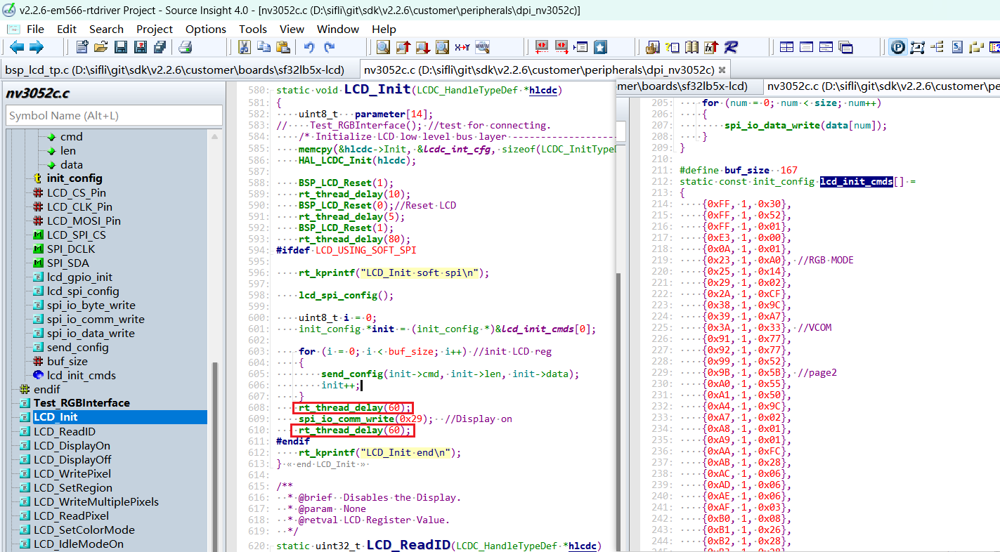<br>
### 5.4 屏驱参数配置
- .lcd_itf ： 选择LCDC_INTF_DPI_AUX表示DPI接口模式<br>
- .freq ：选择 35 * 1000 * 1000,，表示DPI的clk主频为35Mhz，这个时钟要依据屏驱IC支持的最高时钟来选择，越高每帧送数时间越短，帧率会越高<br>
- .color_mode ：选择RGB565 还是RGB888格式<br>
```c
static LCDC_InitTypeDef lcdc_int_cfg =
{
    .lcd_itf = LCDC_INTF_DPI_AUX,
    .freq = 35 * 1000 * 1000,
    .color_mode = LCDC_PIXEL_FORMAT_RGB888,

    .cfg = {
        .dpi = {
            .PCLK_polarity = 0,
            .DE_polarity   = 0,
            .VS_polarity   = 1,
            .HS_polarity   = 1,
            .PCLK_force_on = 0,

            .VS_width      = 5,    // VLW
            .HS_width      = 2,    // HLW

            .VBP = 15,             // VBP
            .VAH = 720,
            .VFP = 16,             // VFP

            .HBP = 44,             // HBP
            .HAW = 720,
            .HFP = 44,             // HFP

            .interrupt_line_num = 1,
        },
    },
};
```
### 5.4 RGB接口飞线测试函数
如果飞线调试的话，RGB数据线较多，接线错误会导致无显示或者显示异常，可以采用下面测试RGB接口函数，R0-R7,G0-G7,B0-B7顺序输出波形，可以逻辑分析仪抓波形查看飞线是否正确<br>
```c
Test_RGBInterface(); //test for connecting.
```
## 6 编译烧录下载结果
### 6.1 显示结果展示
如下图,如果显示正常会依次6种图像，3秒定时循环显示<br>
<br>