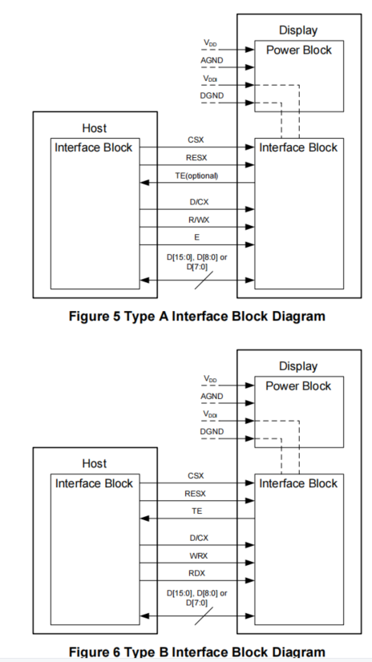
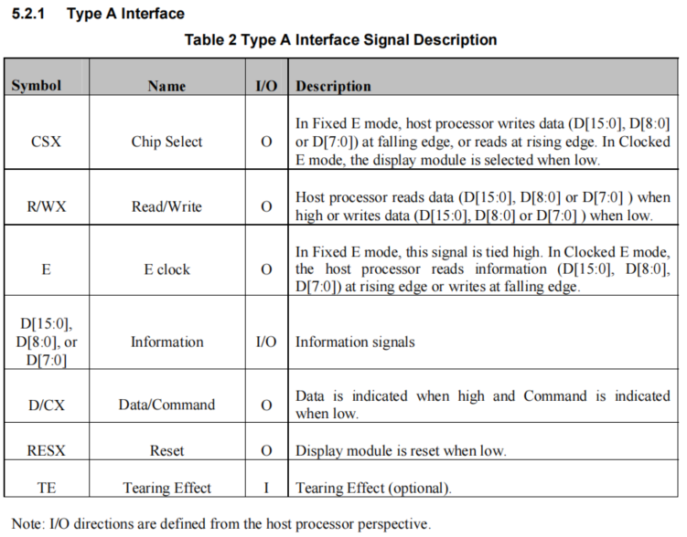
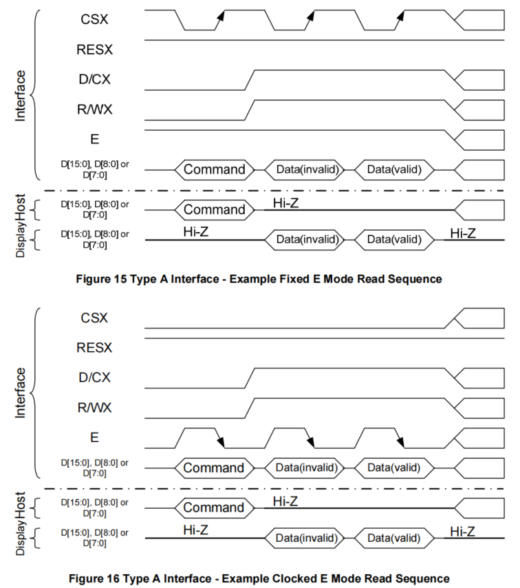
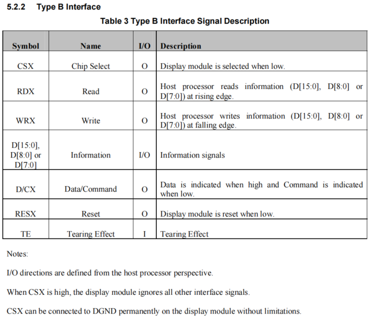

# DBI屏幕参数配置
## 屏幕参数配置讲解

### **MCU/8080接口**
 * MCU/8080接口也就是DBI（Display Bus Interface）模式，分为TYPE A和TYPE B两种方式，下图是两种不同接口的连接方式,
 主要区别在于TYPE A模式把读写信号合成了一根R/WX信号，多了一根E信号，而A模式分为Fixed E模式和Clocked E模式，
 Fixed E模式，E信号固定为高电平1，由CS信号来控制采样，
 Clocked E模式，由E信号来进行控制采样，目前平台默认配置为此模式

  
* 下面是两种接口的端口描述
1. TYPE A



2. TYPE A模式下Fixed E 和 Clocked E的区别



下面是DBI TYPE A模式的配置
```c
static const LCDC_InitTypeDef lcdc_int_cfg =
{
    .lcd_itf = LCDC_INTF_DBI_8BIT_A, /* DBI type A Clocked E模式 */
    .color_mode = LCDC_PIXEL_FORMAT_RGB565,
};
```

3. TYPE B



下面是DBI TYPE B模式的配置
```c
static LCDC_InitTypeDef lcdc_int_cfg_dbi =
{
    .lcd_itf = LCDC_INTF_DBI_8BIT_B, /* DBI type B 模式 */
    .freq = 36000000,
    .color_mode = LCDC_PIXEL_FORMAT_RGB565,

    .cfg = {
        .dbi = {
            .RD_polarity = 0, /* RD 极性选择*/
            .WR_polarity = 0, /* RD 极性选择*/
            .RS_polarity = 0, /* RD 极性选择*/
            .CS_polarity = 0, /* RD 极性选择*/
#ifdef LCD_RM69330_VSYNC_ENABLE
            .syn_mode = HAL_LCDC_SYNC_VER,
#else
            .syn_mode = HAL_LCDC_SYNC_DISABLE,
#endif /* LCD_RM69330_VSYNC_ENABLE */
            .vsyn_polarity = 1, /* Vsnc场同步信号，极性选择（TE打开后才生效）*/
            //default_vbp=2, frame rate=82, delay=115us,
            //TODO: use us to define delay instead of cycle, delay_cycle=115*48
            .vsyn_delay_us = 0, /* （Vsync）TE信号来后，延时多久才是送屏（TE打开后才生效） */
            .hsyn_num = 0,  /* （Vsync）TE信号来后，几个clk脉冲后，延时几个clk后再送屏（TE打开后才生效） */
        },
    },

};
```
