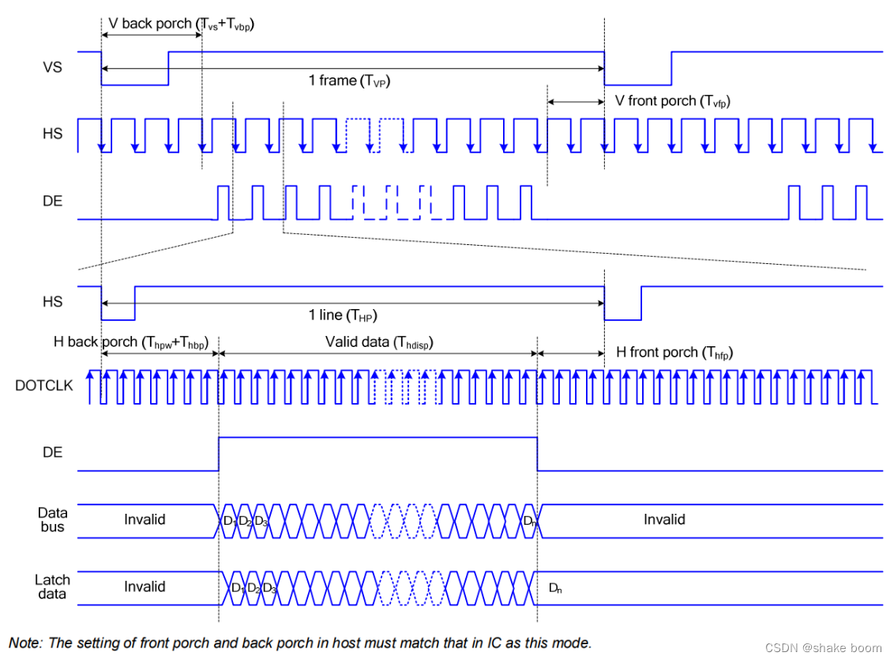

# DPI屏幕参数配置

## 屏幕参数配置讲解
### **DPI/RGB接口**
RGB LCD 液晶屏一般有两种数据同步方式，一种是行场同步模式（HV Mode），另一种是数据使能
同步模式（DE Mode）。当选择行场同步模式时，行同步信号（HSYNC）和场同步信号（VSYNC）作为数据的同步
信号，此时数据使能信号（DE）必须为低电平。
当选择 DE 同步模式时，LCD 的 DE 信号作为数据的有效信号，本例图中DE
信号所示。只有同时扫描到帧有效显示区域和行有效显示区域时，DE 信号才有效（高电平）。当选择 DE
同步模式时，此时行场同步信号 VS 和 HS 必须为高电平。
由于 RGB LCD 液晶屏一般都支持 DE 模式，不是所有的 RGB LCD 液晶屏都支持 HV 模式，因此本章
采用 DE 同步的方式介绍驱动 LCD 液晶屏。
                        
```c
static LCDC_InitTypeDef lcdc_int_cfg =
{
    .lcd_itf = AUTO_SELECTED_DPI_INTFACE,
/*
    DPI的clk频率选择，频率为hcpu主频分频后的频率，比如hcpu主频240Mhz，能够得到的频率只能为40/48/60/80,如果设置62Mhz，实际会设置为60Mhz
*/    
    .freq = 48 * 1000 * 1000,
/*
DPI接口输出的颜色格式
1. LCDC_PIXEL_FORMAT_RGB565为常见的RGB565色
2. LCDC_PIXEL_FORMAT_RGB888为常见的RGB888色 
*/    
    .color_mode = LCDC_PIXEL_FORMAT_RGB888,

    .cfg = {
        .dpi = {
            .PCLK_polarity = 0, /* 选择DPI波形中Pclk（像素时钟信号线）的极性 */
            .DE_polarity   = 0, /* 选择DPI波形中DE（数据使能信号）的极性 */
            .VS_polarity   = 1, /* 选择DPI波形中VS（V sync 场同步信号）的极性 */
            .HS_polarity   = 1, /* 选择DPI波形中HS（H sync 行同步信号）的极性 */

            .VS_width      = 2,  /* 选择VS（场同步信号）持续的宽度，单位为（几个HS波形） */
            .HS_width      = 2, /* 选择HS（行同步信号）持续的宽度，单位为（几个Pclk波形） */
            .VBP = 23,   /* VBP（V back porch 帧显示后沿或后肩）的宽度，单位为（几个HS波形） */
            .VAH = 600, /* 选择屏的垂直高度，单位为（行） */
            .VFP = 12,   /* VFP（V front proch 帧显示前沿或前肩）的宽度，单位为（几个HS波形）*/

            .HBP = 160,  /* HBP（H back porch 行显示后沿或后肩）的宽度，单位为（几个Pclk波形）*/
            .HAW = 1024, /* 选择屏的水平宽度，单位为（列） */
            .HFP = 160,  /*  HFP（H front porch 行显示前沿或前肩）的宽度，单位为（几个Pclk波形）*/

            .interrupt_line_num = 1,
        },
    },
};
```

按照上面的PCLK,DE,VS,HS的极性配置,可以输出对应下图所示的波形：

[参考文章：](https://blog.csdn.net/weixin_50965981/article/details/134496428)https://blog.csdn.net/weixin_50965981/article/details/134496428
***


## DPI_AUX模式的使用限制
如果你的屏幕宽度≤512像素，则不会使用该模式，就不需要关心这部分。

如果你的屏幕宽度≤1024像素, 并且使用的是58x芯片，也不需要关心这部分。


### 什么是DPI_AUX
对DPI屏幕接口的宏`AUTO_SELECTED_DPI_INTFACE` 实际会根据芯片和屏幕宽度自动选择以下2种模式：

- **DPI模式**<br>
LCD控制器原生模式，支持的屏幕最大宽度：58x下是1024，其他是512。

- **DPI_AUX模式**<br>
针对超出LCD控制器原生模式宽度的屏幕而做的辅助模式。

### 使用限制
当使用DPI_AUX模式时，有以下使用限制：

#### 一、不能打开自动降系统主频（BSP_PM_FREQ_SCALING）
自动降频会影响硬件刷新机制的运行，在关闭屏幕后才可以降频。
#### 二、Framebuffer 必须是全屏且行数为偶数
#### 三、以下数组需要放在SRAM，但是不能是retention-SRAM段

drv_lcd.c中的ramless_code，sram_data0，sram_data1
* 55x 避免放在0x00020000 ~ 0x00030000
* 56x 避免放在0x20000000 ~ 0x20020000

:::{note}
SDK 2.2.4之后，这部分数组改成了从系统堆里面自动分配一个非Retention-SRAM的内存。
:::
#### 四、刷屏期间需要一直占用如下硬件模块：

56x:
1. 普通DMA的一个channel(可配置，默认DMA1-CH5）
2. EXTDMA
3. PTC模块
4. BUSMONITOR
5. BTIM2

55x:
1. 普通DMA的一个channel(可配置，默认DMA1-CH8）
2. EXTDMA
3. PTC模块
4. BUSMONITOR
5. BTIM1, BTIM2


```{caution}
1. 对于NAND系统需要打开PSRAM_CACHE_WB，避免EXTDMA使用冲突
2. 避免使用lvgl lv_scheme0 (LV_FRAME_BUF_SCHEME_0)，避免EXTDMA使用冲突
3. 避免使用sifli_memcpy,sifli_memset，避免EXTDMA使用冲突
4. 在dma_config.h 中要根据目前SPI\UART\I2C\I2S 等模块的dma channel使用情况，避免DMA channel冲突
```
