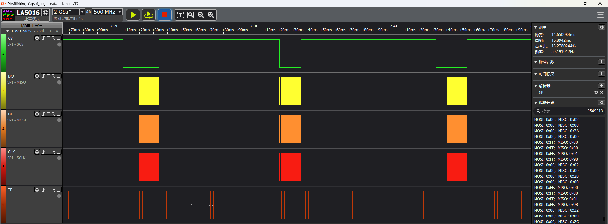
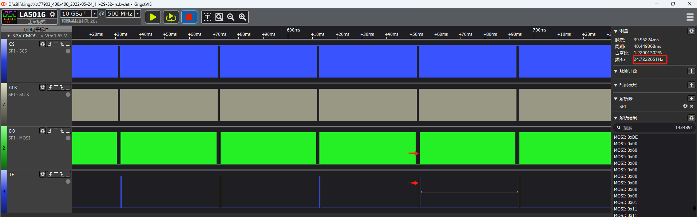

# SPI屏幕参数配置


## 屏幕参数配置讲解

### **4线/3线 SPI接口**
```c
static LCDC_InitTypeDef lcdc_int_cfg =
{
/*
1. LCDC_INTF_SPI_NODCX_2DATA：SPI四线模式，QSPI的DO发数据，D1读数据模式
2. LCDC_INTF_SPI_NODCX_1DATA：SPI三线模式，收发数据都在QSPI的D0 
3. LCDC_INTF_SPI_DCX_1DATA：多一条D/CX的线，当D/CX为低时，用来传输指令，当D/CX为高时，用来传输数据
*/
    .lcd_itf = LCDC_INTF_SPI_NODCX_2DATA,
/*  QSPI的clk频率选择，频率为hcpu主频分频后的频率，比如hcpu主频240Mhz，能够得到的频率只能为40/48/60/80,如果设置62Mhz，实际会设置为60Mhz */
    .freq = 24000000,
    .color_mode = LCDC_PIXEL_FORMAT_RGB565,

    .cfg = {
        .spi = {
            .dummy_clock = 0, /* 是在QSPI读模式下，配置cmd和data之间空的clk数量，默认为0，不用修改 */
/* 该选项是为了避免出现图像撕裂，（出现撕裂原因：屏读取RAM数据时，QSPI也在往RAM送数） */
#ifdef LCD_ST7789P3_VSYNC_ENABLE				
            .syn_mode = HAL_LCDC_SYNC_VER,/* 启动检查屏送出的TE信号，并同步给RAM送数，打开此配置，如果屏无TE信号输出，会出现无法给RAM送数，出现死机 */
#else
			.syn_mode = HAL_LCDC_SYNC_DISABLE,/* 关闭检查屏送出的TE信号，在刚开始调试屏驱动，不考虑撕裂问题时，采用此配置 */
#endif
/*
该配置在选择HAL_LCDC_SYNC_VER后，才有意义，用于配置TE（Vsync）信号来时的信号极性，
配置为1，TE平常是低电平，TE为高电平时可以给RAM送数 
*/
            .vsyn_polarity = 0,
            .vsyn_delay_us = 1000,/* 该配置在选择HAL_LCDC_SYNC_VER后，才有意义，用于配置TE信号高电平延时多少us后，再给RAM送数*/
            .hsyn_num = 0,/* 该配置在选择HAL_LCDC_SYNC_VER后，才有意义，用于配置TE信号高电平几个clk脉冲后，再给RAM送数 */
/*
1. 在QSPI读数据的时候，CMD都会从D0输出，但是读回的数据，不同屏驱IC，会从D0-D3进行输出，为了兼容不同的屏驱IC，才有此配置
2. 可以配置为0-3，参考屏驱IC的规格书，选择QSPI对应read时从D0 - D3进行读取信号 
*/            
            .readback_from_Dx = 0,
        },
    },
};
```
下图是4线TE没有使能的波形图,可以见到TE的波形没有跟SPI的CS下降沿进行对齐

### **帧率测试方法**
* 打开HAL_LCDC_SYNC_VER配置，SPI的时序如下图，送屏会跟TE对齐
- [LCD显示异常分析——撕裂(tear effect)](https://blog.csdn.net/hexiaolong2009/article/details/79319512)
* 在UI帧率很高的界面下，查看测试TE的频率，就是达到刷屏的帧率数

***
### **QSPI接口**

```c
#ifdef LCDC_USE_DDR_QSPI
    #define QAD_SPI_ITF LCDC_INTF_SPI_DCX_DDR_4DATA
    #define QAD_SPI_ITF_FREQ   40000000
#else
    #define QAD_SPI_ITF LCDC_INTF_SPI_DCX_4DATA
    #define QAD_SPI_ITF_FREQ   48000000
#endif
static LCDC_InitTypeDef lcdc_int_cfg_spi =
{
 /*
 1. DDR（qspi的clk双沿送数方式）选择 LCDC_INTF_SPI_DCX_DDR_4DATA
2. SDR（qspi的clk单沿送数方式）选择 LCDC_INTF_SPI_DCX_4DATA
 */   
    .lcd_itf = QAD_SPI_ITF, //LCDC_INTF_SPI_NODCX_1DATA,
/*
1. QSPI的clk频率选择，频率为hcpu主频分频后的频率，比如hcpu主频240Mhz，能够得到的频率只能为40/48/60/80,如果设置62Mhz，实际会设置为60Mhz
2. DDR模式下，QSPI的clk频率不能设置过高
*/    
    .freq = QAD_SPI_ITF_FREQ,
/*
1. LCDC_PIXEL_FORMAT_RGB565为常见的RGB565色
2. LCDC_PIXEL_FORMAT_RGB888为常见的RGB888色
*/
#if LV_COLOR_DEPTH == 24
    .color_mode = LCDC_PIXEL_FORMAT_RGB888,
#else
    .color_mode = LCDC_PIXEL_FORMAT_RGB565,
#endif

    .cfg = {
        .spi = {
            .dummy_clock = 0, /* 是在QSPI读模式下，配置cmd和data之间空的clk数量，默认为0，不用修改 */
/* 该选项是为了避免出现图像撕裂，（出现撕裂原因：屏读取RAM数据时，QSPI也在往RAM送数）*/
#ifdef LCD_FT2308_VSYNC_ENABLE
            .syn_mode = HAL_LCDC_SYNC_VER, /* 启动检查屏送出的TE信号，并同步给RAM送数，打开此配置，如果屏无TE信号输出，会出现无法给RAM送数，出现死机*/
#else
            .syn_mode = HAL_LCDC_SYNC_DISABLE, /* 关闭检查屏送出的TE信号，在刚开始调试屏驱动，不考虑撕裂问题时，采用此配置 */
#endif
/* 该配置在选择HAL_LCDC_SYNC_VER后，才有意义，用于配置TE（Vsync）信号来时的信号极性 */
            .vsyn_polarity = 1, /*  配置1，TE平常是低电平，TE为高电平时可以给RAM送数 */
            .vsyn_delay_us = 0, /* 该配置在选择HAL_LCDC_SYNC_VER后，才有意义，用于配置TE信号高电平延时多少us后，再给RAM送数 */
            .hsyn_num = 0, /* 该配置在选择HAL_LCDC_SYNC_VER后，才有意义，用于配置TE信号高电平几个clk脉冲后，再给RAM送数 */
 /*
 1. 在QSPI读数据的时候，CMD都会从D0输出，但是读回的数据，不同屏驱IC，会从D0-D3进行输出，为了兼容不同的屏驱IC，才有此配置
2. 可以配置为0-3，参考屏驱IC的规格书，选择QSPI对应read时从D0 - D3进行读取信号
 */           
            .readback_from_Dx= 3,       /*!< 0 read back data from D0 (HW SPI support), 1 read back from D1(Software SPI support).*/
#ifdef LCDC_USE_DDR_QSPI
            .flags = SPI_LCD_FLAG_DDR_DUMMY_CLOCK,/* 该标志位是为了适配DDR屏，DDR模式下送完framebuffer后加入几个空clock */
#endif /* LCDC_USE_DDR_QSPI */
        },
    },

};
```
***

