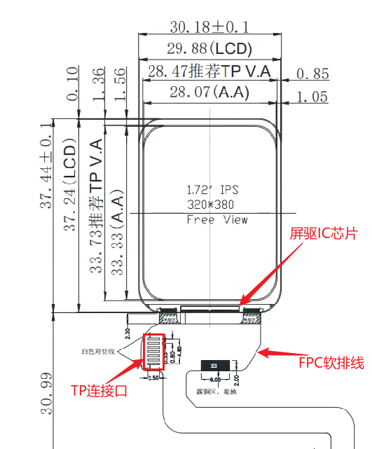
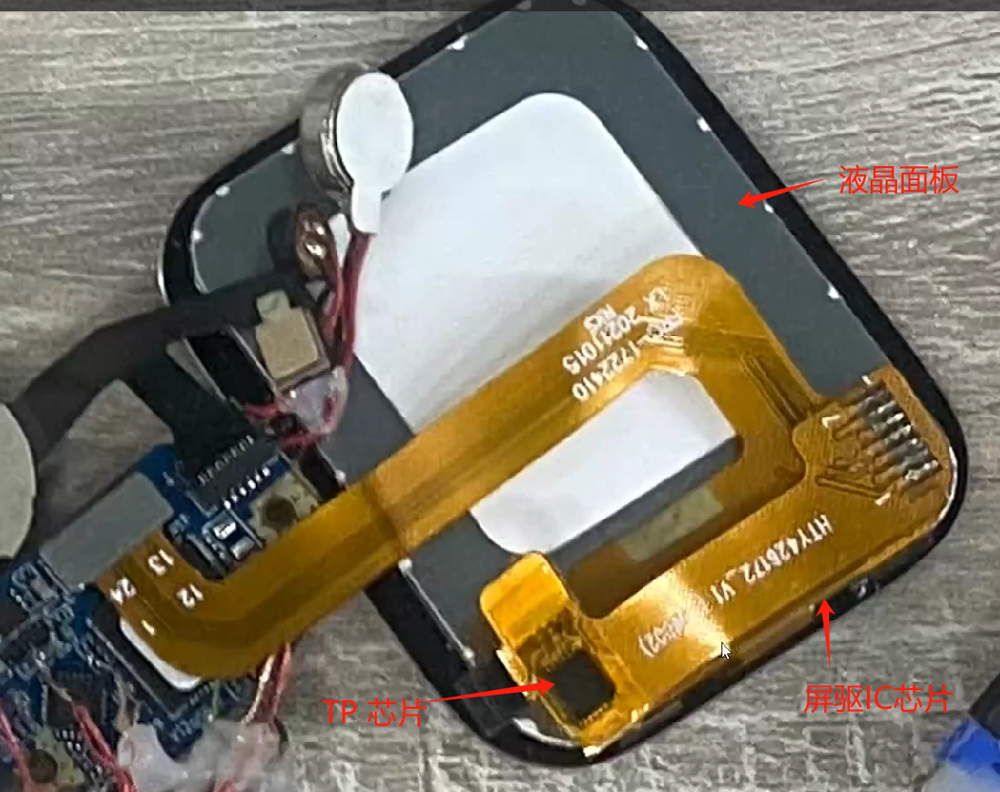

# 屏幕模组介绍

## 屏幕模组构成
一个屏幕模组通常包括屏幕驱动IC，液晶面板，背光面板（AMOLED屏没有），FPC软排线等，对于支持触摸功能的屏幕，还会有单独的触控（TP）驱动IC。

相应的，一个屏幕模组的调试也会涉及到屏幕驱动芯片的驱动程序调试，以及背光面板或供电的驱动程序调试等，触控屏幕还需要进行触控芯片的驱动程序调试。

 

## 屏幕驱动芯片的常见接口
通常一颗屏驱IC能支持多种接口，具体采用哪种，在屏幕模组上，通过对屏驱IC的IO口的IM[2:0]信号的上下拉配置来进行选择，也有一些屏驱IC可以通过内部寄存器进行接口的选择，具体以屏幕模组的说明文档为准。
常见的屏幕接口有如下几类：
1. [SPI](#spi_link)
2. [DPI/RGB](#dpi_link)
3. [MIPI-DSI](#dsi_link)
4. [MCU/8080](#8080_link)  


(spi_link)=
### SPI接口  

SPI接口在屏幕模组中应用非常广泛，因其占用接口少，传输带宽高，所以既可以被用作屏驱配置接口，也可以直接用来传输图像数据。尤其在低分辨率的场景下，通过SPI接口就可以达到相当高的刷新帧率。  
通过SPI接口进行屏驱配置的方式与传统SPI没有差别，这里不做过多赘述，以下内容主要针对的是图像数据传输的SPI接口(以下简称图像SPI接口)。\
\
\
**图像SPI接口分类：**  
**图像SPI接口根据传输协议分为3-wire SPI和4-wire SPI。**  
- **3-wire SPI**  
    顾名思义，有三根信号线，分别是片选CS，时钟SCLK，双向数据线SDIO。传输时，先发送一个Data/Command标识bit，然后进行传输。如下图：
    ```{figure} ../assets/spi_3wire_wr.bmp
    :alt: spi_3wire_wr
    :class: bg-primary
    :scale: 70 %
    :align: center
    ```
    可以看到图中CS拉低选中后，SDO上先发送了DCX信号，用来表明接下去传输的是数据还是指令，然后再进行传输。因此，3-wire SPI传输时，实际的有效带宽是理论带宽的8/9。

- **4-wire SPI**  
    相较3-wire SPI，4-wire SPI额外增加了DC信号线用来标识传输数据和指令。传输过程如下图：
    ```{figure} ../assets/spi_4wire_wr.bmp
    :alt: spi_4wire_wr
    :class: bg-primary
    :scale: 70 %
    :align: center
    ```
    图中的DCX信号在传输过程中，会保持稳定，用来标识当前传输的是数据还是指令。因为引入了额外的DCX信号线，所以4-wire SPI的实际有效带宽会高于3-wire SPI，等于理论带宽。  

**图像SPI接口除了根据传输协议分类，也可以通过数据线位宽进行分类。常见的数据线位宽有1-bit(单数据线SPI)，2-bit(双数据线DSPI)，4-bit(四数据线QSPI)。**  

- **单数据线SPI**  
    单数据线SPI在每个时钟周期传输1-bit的数据，前文提到的3-wire SPI和4-wire SPI均为单数据线SPI，这里就不再过多赘述。  
    <br/>
- **双数据线DSPI**  
    双数据线SPI在每个时钟周期传输2-bit的数据，相比单数据线SPI，传输带宽提高了一倍。  
    \
    3-wire SPI对应的DSPI传输如下图所示：
    ```{figure} ../assets/spi_3wiredl_wr.bmp
    :alt: spi_3wiredl_wr
    :class: bg-primary
    :scale: 70 %
    :align: center
    ```
    图中可以看到，与3-wire SPI的协议类似，每一笔传输前都会单独使用一个周期发送DCX标识bit，然后在进行后续信号传输。图中所示每传输8bit对应一个DCX标识位，则实际带宽为理论带宽的4/5。实际使用中很多屏驱为了获得的带宽，会支持每传输16bit，或者24bit对应一个DCX标识位。这样带宽利用率可以提高到8/9以及12/13。  
    \
    4-wire SPI对应的DSPI传输如下图所示：  
    ```{figure} ../assets/spi_4wiredl_wr.bmp
    :alt: spi_4wiredl_wr
    :class: bg-primary
    :scale: 70 %
    :align: center
    ```
    图中可以看到，4-wire SPI对应DSPI没有单独的DCX标识位，在实际屏驱芯片中，一些屏驱芯片通过单数据线的指令进入数据传输模式，所以在后续传输中就不需要DCX标识位了。这样做可以最大化利用DSPI的带宽，使DSPI的实际带宽跟理论一致。相比单数据线的4-wire SPI，双数据线DSPI使用相同的信号数量，带宽则达到了两倍。  
    <br/>

- **四数据线QSPI**  
    四数据线QSPI相较双数据线DSPI，又额外增加了两根信号线负责数据传输。  
    \
    3-wire SPI对应的QSPI传输如下图所示：
    ```{figure} ../assets/spi_3wireql_wr.bmp
    :alt: spi_3wireql_wr
    :class: bg-primary
    :scale: 70 %
    :align: center
    ```
    图中可以看到，QSPI在每一笔传输前会先发送一个DCX，然后进行后续的传输。图中每传输8bit对应一个DCX标识位，则实际带宽为理论贷款的2/3。实际屏驱芯片会支持每一个DCX标识位，传输16bit或24bit的数据，这样带宽利用率可以提高到4/5或者8/9。  
    \
    4-wire SPI对应的QSPI传输如下图所示：
    ```{figure} ../assets/spi_4wireql_wr.bmp
    :alt: spi_4wireql_wr
    :class: bg-primary
    :scale: 70 %
    :align: center
    ```
    图中QSPI在传输数据时，与DSPI一样没有DCX标识位，这样可以保证实际带宽达到理论带宽。同样大部分屏驱芯片会通过单数据线的指令进入数据传输模式，从而在数据传输过程中最大化利用QSPI的带宽能力。  


\
以上是最常见的SPI接口，协议上分为3-wire和4-wire两种模式，数据位宽上分为单数据线，双数据线和四数据线。两者组合共有6种模式，用户需要根据实际屏驱文档，确定实际场景中使用的模式。对于SPI接口，外部的屏驱一般情况下需要带有GRAM，所以对外部屏驱要求会高一些。
\
为了进一步提升传输带宽，最近也有一些屏驱芯片开始支持DDR模式的数据传输，相比较SDR模式，带宽又可以提升一倍。
\
<br/>
<br/>


(dpi_link)=
### DPI/RGB接口

DPI接口也就是通常所说的RGB接口，DPI接口一般由16~24bit的数据信号，以及PCLK，HSYNC，VSYNC，DE等时钟和控制信号组成。DPI接口的屏驱通常没有内部GRAM，需要主控端持续发送图像数据，对屏幕内容持续刷新，因此对主控的性能要求也更高。  
DPI信号接口图示：  
```{figure} ../assets/image-54.png
:alt: dpi connection
:class: bg-primary
:scale: 99 %
:align: center
```
DPI接口信号需要满足DPI专有的时序，大致可以参考下图所示：  
```{figure} ../assets/image-59.png
:alt: dpi protocol
:class: bg-primary
:scale: 99 %
:align: center
```
如图所示，用户在配置DPI屏幕接口时，需要参考屏驱芯片资料，对图中各项时序参数进行配置。参数包括：VS_WIDTH，HS_WIDTH，HBP，HFP，VBP，VFP，Vertical Display Area，Horizontal Display Area。
<br/>
<br/>


(dsi_link)=
### MIPI-DSI接口
MIPI-DSI接口，也就是通常所说的MIPI屏接口，该接口由一对时钟差分信号线和1/2/4对数据差分信号线组成。因为时钟和数据均为差分信号，所以MIPI接口有更高的速率，更强的抗干扰能力。同时对电路外围的干扰也会更小，很适合于高集成度的场景，例如穿戴设备。  
MIPI-DSI接口通常有两种工作模式，Command模式和Video模式。Command针对的是相对较小分辨率，有内部GRAM的屏驱芯片，大部分SPI接口的屏幕也是这一类屏驱芯片。Video模式针对没有GRAM的屏驱芯片，需要持续的对屏幕进行刷新，机制与DPI接口类似。该模式对MCU主端要求也较高。  
下图所示是单Data Lane的DSI接口：  
```{figure} ../assets/image-56.png
:alt: dsi connection
:class: bg-primary
:scale: 99 %
:align: center
```
<br/>
<br/>

(8080_link)=
### MCU/8080接口

MCU/8080接口有很多其他名称，因为其最早起源于Intel的接口，所以也被称为Intel接口，另外一个比较常用的名字叫做DBI接口，其来源于MIPI标准中的DBI接口协议。该接口由独立的读写控制信号，8/16跟数据总线组成。  
下图所示是典型的MCU/8080接口图：  
```{figure} ../assets/image-57.png
:alt: dbi connection
:class: bg-primary
:scale: 99 %
:align: center
```
图中的MCU/8080接口有片选信号CSX，写控制WRX，读控制RDX，Data/Command选择D/CX，以及8跟数据线组成。写的时候通过翻转WRX发送数据，读的时候通过翻转RDX读取数据。其访问方式类似于内存访问。  
MCU/8080接口优点在于控制简单，易于实现。但缺点也比较明显，作为并行接口，用的信号较多，速率相对较低。另外MCU/8080接口要求屏驱侧带有GRAM，这样屏驱的成本也会更高。  


