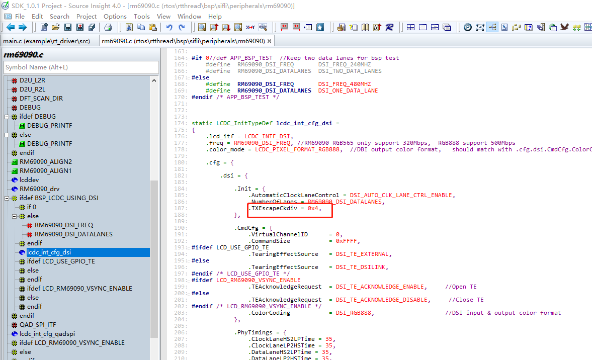
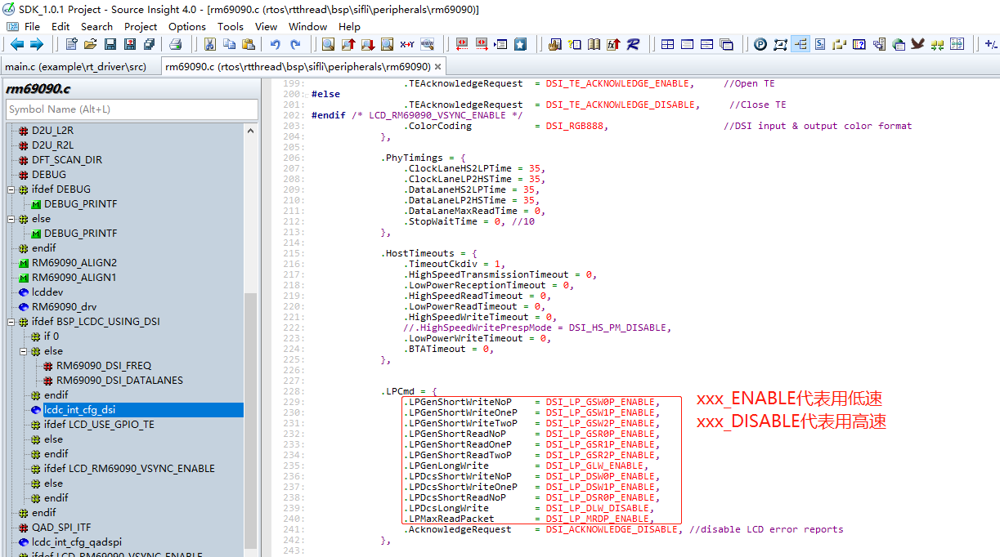
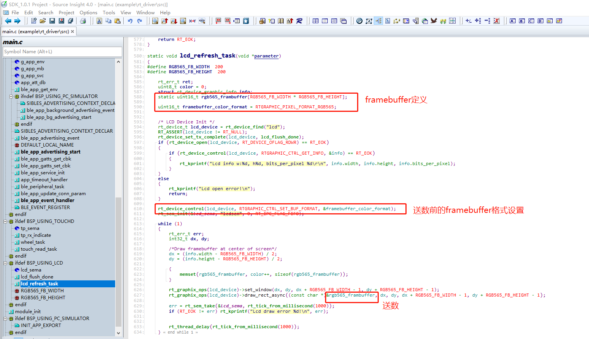
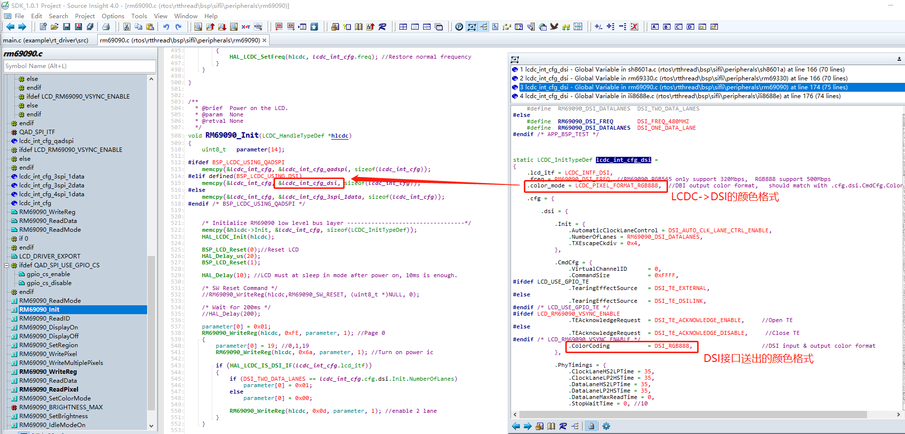
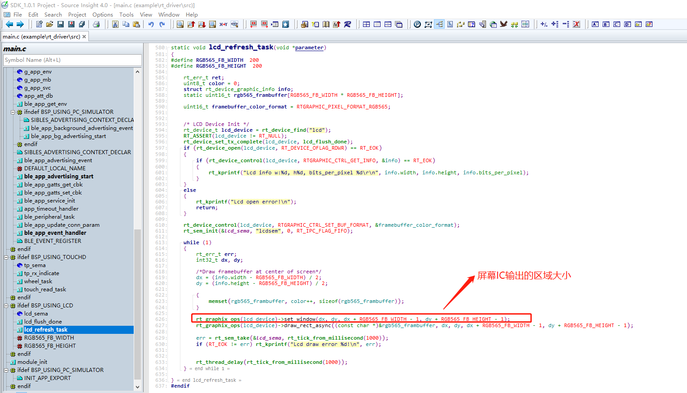
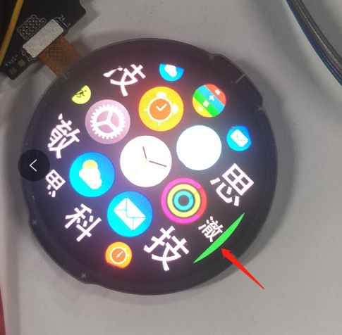
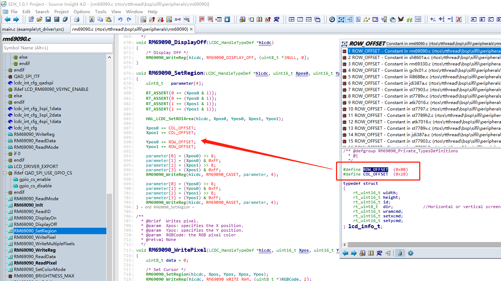
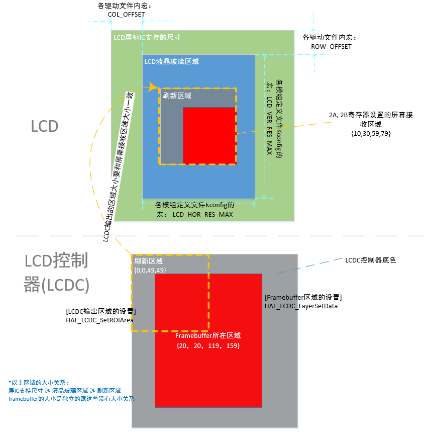
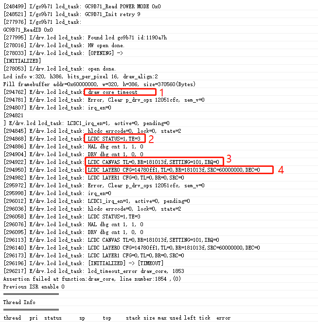

## FAQ

### 屏幕ID读取失败
* 检查供电是否正确
* 检查IO电压是否匹配（我们芯片支持1.8V的IO, 有不少LCD是3.3V)
* 检查屏幕复位时间是否足够
* 尝试降低接口频率
* 检查时序

### DSI屏幕切换到低速模式
1.将系统时钟降到48M
在drv_io.c内，将HAL_RCC_HCPU_ClockSelect(RCC_CLK_MOD_SYS, XXX); XXX就是系统时钟频率，改成RCC_SYSCLK_HXT48（晶体时钟48MHz)
这是为了降低LCDC往DSI送数的速度

2.调整DSI LP 模式的频率到屏幕能支持的范围(一般在6~20Mbps), 
如下配置时LP模式频率 = 480MHz / 16 / 4 = 7.5Mbps(其中480MHz为freq, 16 为固定值， 4为TXEscapeCkdiv)

3.将所有命令都改成LP模式(低速模式)发送

### 屏幕不亮
* 检查ID是否可以读到
* 先关闭TE，防止TE信号没有导致LCD控制器不送数据
* 检查送的数据是否是全黑色的

### 屏幕颜色格式的设置
我们的LCD控制器 可以转换不同格式的framebuffer到LCD输出接口，确保framebuffer和LCD输出两端的配置正确

framebuffer的颜色格式设置示例（RGB565格式的framebuffer)

LCD控制器输出的颜色格式示例（DSI输出RGB888)

*framebuffer送到LCDC控制器后先转成RGB888格式的数据，然后送给DSI链路控制器再输出RGB888数据

### 屏幕显示花屏

* 检查framebuffer的颜色格式和LCD控制器送出的颜色格式是否正确（参考前面FAQ《屏幕颜色格式的设置》)
* 检查IC输出的屏幕区域和液晶玻璃的分辨率是否一致，参考《屏驱IC、液晶玻璃、刷新区域、framebuffer的相对位置关系》章节。
    
* 是否没有送数，显示的默认GRAM数据（改变framebuffer，检查屏幕是否有变化）

### 屏幕显示（部分）绿色背景
其中一个实例如下图：

* 检查设置LCD接受数据区域的偏移是否正确

* 检查送的数据是否正确

### 对齐要求和屏幕分辨率不符合的死机
死机原因：
客户有些屏幕分辨率比如是320x385, 但是他的对齐要求却是2，按照对齐要求分辨率必须都是偶数（比如320x386），上层或者驱动在刷屏时会自动对齐到偶数，导致刷屏区域超过分辨率，就会出现断言。

解决思路：
	对上还是提供满足对齐要求的分辨率的屏幕，只改动驱动代码。

解决办法：
* 在Kconfig定义屏幕分辨率时，需要按照对齐后的分辨率配置，虚拟一个满足对齐要求的屏幕。
    * Kconfig对应的宏是LCD_HOR_RES_MAX 和 LCD_VER_RES_MAX
    * 比如上面的例子是配成320x386
* 在LCD驱动的xxxx_SetRegion函数里面，检查送进来的参数是否超过真实的分辨率，咨询屏厂该如何处理。
    * 有的屏幕是直接截取，比如上面的例子中检查Ypos1，超过385的就直接改成385
    * 有的屏幕是可以直接刷，也不会覆盖到第一行。

### 上层图形库不动，只换屏幕
这种问题参考《对齐要求和屏幕分辨率不符合的死机》的做法，只在驱动层进行截取即可，对上还是提供满足要求的屏幕。

(lcd-lcdc-coordinates-relationship)=
### 屏驱IC、液晶玻璃、刷新区域、framebuffer的相对位置关系

### 死机
如下图所示，是比较常见的刷屏超时死机，原因是因为没有等到屏幕的TE信号，而超时死机，超时时间定义在`MAX_LCD_DRAW_TIME`,默认是500ms。

| 图片内的标号 | 寄存器含义说明|
| ---- | ---- |
| 1 | “draw core timeout”  -- 代表的是刷屏没有等到TE，从而超时死机|
| 2 | STATUS=1 代表LCDC控制器一直处于忙状态（比如等TE信号）， TE=3 只需看bit0， bit0 如果是1代表LCDC在刷屏之前需要等TE信号，0代表不需要等TE信号。 Log里面打印了2遍TE寄存器的值，可以观察这期间TE信号是否有来。 |
| 3 | CANVAS 的TL, BR是刷新区域的坐标，TL的高16bit是y0, 低16bit是x0; BR的高16bit是y1, 低16bit是x1; 组成刷新区域{x0,y0,x1,y1} |
| 4 | LAYER0的TL,BR是framebuffer所在的区域左边，格式同上面的CANVAS的TL,BR类似；  SRC是framebuffer的数据地址 |

解决办法：
1. 如果是一开机就出现这个死机，大概率是屏驱有问题，检查屏幕的上电、复位，屏初始化代码等。
2. 如果是睡眠唤醒出现这个死机，可能是初始化的复位时间不够，或者睡眠时关闭屏幕的流程不符合要求。
3. 如果刷屏期间突然出现这个死机，可能屏驱不稳定（比如IO电平不匹配、速率太高），或者静电导致屏驱IC死机。