# 思澈SDK的显示框架介绍

## 简介

思澈的显示框架是基于[rt_device框架](https://www.rt-thread.org/document/site/#/rt-thread-version/rt-thread-standard/programming-manual/device/device?id=%e8%ae%bf%e9%97%ae-io-%e8%ae%be%e5%a4%87)的，具有如下特点：
- 同一个屏幕驱动、TP驱动、背光驱动可以在不同的开发板之间复用
- 同一个开发板可以通过menuconfig选择不同的屏幕模组
- 支持同时兼容多个屏幕驱动、TP驱动，根据ID来区分


<br/>
<br/>
这样设计确实提高了复用度，但也给屏幕模组驱动配置带来了分散性的问题:

- 屏幕模组的上下电、复位接口、pinmux的设置、背光用到的pwm等程序都与开发板的相关联(类似屏驱模组的BIOS)
- 屏幕驱动、TP驱动、背光驱动的编写需要基于上面提供的这些宏定义、IO接口来实现
- 最终将实现的屏幕驱动、TP驱动、背光驱动汇集成一个menuconfig菜单，供开发板选择。
<br/>
<br/>
<br/>


(lcd_driver_folder_strcuture)=
## 目录结构
此处以eh-lb525板子，屏幕模组（nv3051f屏驱+gt911触控驱动）， aw9364背光驱动芯片 为例：

```
SDK
│
├──customer
│   ├──boards
│   │   ├──eh-lb52xu            #eh-lb525板子的板级目录
│   │   │   ├──bsp_lcd_tp.c     #屏幕和TP上下电、复位接口实现、通信接口的pinmux配置等
│   │   │   └──Kconfig.board    #屏幕和TP上下电、复位管脚的定义、pwm背光引脚的定义
│   │   │
│   │   │
│   │   └──Kconfig_lcd     #屏幕模组的menuconfig菜单定义（汇集屏驱、TP驱动、背光类型、以及屏幕模组分辨率的宏定义）
│   │
│   │
│   └──peripherals
│       ├──nv3051f1              #nv3051f1屏幕驱动的目录
│       │   ├──nv3051f1.c        #屏驱的实现
│       │   └──SConscript        #编译链接文件
│       │
│       ├──gt911                #gt911触控驱动的目录
│       │   ├──gt911.c          #触控驱动的c文件
│       │   ├──gt911.h          #触控驱动的头文件
│       │   └──SConscript        #编译链接文件
|       |
│       ├──aw9364                #aw9364背光驱动芯片，背光设备“lcdlight”
│       │   ├──aw9364.c          #背光驱动芯片的c文件
│       │   ├──aw9364.h          #背光驱动芯片的头文件
│       │   └──SConscript        #编译链接文件
│       │   
│       └──Kconfig              #屏驱IC、触控IC、背光IC的宏定义处
│
├──rtos
│   └──rtthread
│       └──bsp
│           └──sifli
│               └──drivers
│                   ├──drv_touch.c  #TP驱动管理层，对应用层提供“touch”设备
│                   └──drv_lcd.c    #LCD驱动的管理层，对应用层提供“lcd”设备
│
│
└──examples        #示例应用
    └──rt_driver   #屏幕调试工程, 调用“lcd”和“touch"设备

```


<br/>
<br/>
<br/>
<br/>

## 屏幕部分
### 屏幕框架图
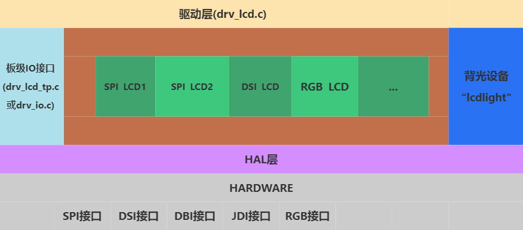

**图内各项解释：**
- 驱动层(drv_lcd.c) --- 实现了名为“lcd”的rt_device，供上层操作屏幕。
- 中间绿色部分具体的驱动代码（为客户添加屏幕驱动的主要代码）
- 板级IO接口文件(bsp_lcd_tp.c, 或 drv_io.c) ---  为屏幕驱动提供统一的上电、下电、复位的接口。
- 背光设备”lcdlight" --- 为屏幕驱动提供统一的背光控制接口
- HAL层（bf0_hal_lcdc.c） --- 为屏幕驱动提供基本统一的参数配置、LCD寄存器读写等接口

<br/>
<br/>
<br/>
<br/>

(lcd-driver-register)=
### 注册屏驱到系统
思澈的屏驱框架支持同时注册多个屏驱到系统，通过宏`LCD_DRIVER_EXPORT2`生成一个特殊段名的变量，链接到一起。

在nv3051f1.c中通过LCD_DRIVER_EXPORT2将屏驱的回调函数注册到系统，每个函数的详细解析请参考[屏驱回调函数](./屏驱回调函数.md)：
```
static const LCD_DrvOpsDef LCD_drv =
{
	LCD_Init,    			  //【必选】，屏驱初始函数(包括复位，初始化程序等) 
	LCD_ReadID,    			  //【必选】，屏幕在位检测函数 
	LCD_DisplayOn,   		  //【必选】，屏幕打开 
	LCD_DisplayOff,  		  //【必选】，屏幕关闭 
	LCD_SetRegion,    		  //【必选】，设置屏幕接受数据时的区域（2A,2B 的区域）
	LCD_WritePixel,   		  // 可选，写一个像素点到屏幕上
	LCD_WriteMultiplePixels,  //【必选】，写批量像素点到屏幕上
	LCD_ReadPixel,    		  // 可选，读屏幕上的一个像素点数据，返回像素的RGB值
	LCD_SetColorMode,    	  // 可选，切换输出给屏幕的颜色格式
	LCD_SetBrightness,   	  // 可选，设置屏幕的亮度 
	LCD_IdleModeOn,    		  // 可选，进入待机显示模式（低功耗模式） 
	LCD_IdleModeOff,   		  // 可选，退出待机显示模式（低功耗模式） 
	LCD_Rotate,  			  // 可选，旋转屏幕一定角度 
	LCD_TimeoutDbg, 		  // 可选，批量送数超时后，屏幕自检 
	LCD_TimeoutReset,  		  // 可选，批量送数超时后，屏幕复位 
	LCD_ESDCheck,  		      // 可选，屏幕定时ESD检测 
};

LCD_DRIVER_EXPORT2(nv3051f1, LCD_ID, &lcdc_int_cfg, &LCD_drv,2);
```
<br/>
<br/>
<br/>
<br/>

(lcd-driver-detect-method)=
### 屏幕在位检测
当系统注册了多个屏幕驱动时，如何判断使用哪个屏驱来驱动当前屏幕，就需要通过屏幕在位检测。方法是先调用每个屏驱的[LCD_Init](lcd-cb-func-lcd-init)函数，让其初始化，然后在调用[LCD_ReadID](lcd-cb-func-lcd-readid)函数，如果[LCD_ReadID](lcd-cb-func-lcd-readid)函数返回的值与LCD_ID值相同时，认为屏幕在位，则使用该屏驱。否则继续调用下一个屏驱的[LCD_Init](lcd-cb-func-lcd-init)和[LCD_ReadID](lcd-cb-func-lcd-readid)。
- _[LCD_Init](lcd-cb-func-lcd-init)和[LCD_ReadID](lcd-cb-func-lcd-readid) 是每个[屏驱注册的回调函数](lcd-driver-register)_
-  _LCD_ID是通过LCD_DRIVER_EXPORT2传入的参数_

(lcd-ic-pixel-alignment)=
### 屏幕刷新的像素对齐
有些屏驱的刷新区域有像素对齐要求，思澈的屏驱框架可以支持设置像素对齐（如果有的屏幕行列对齐要求不一致，则用最大的值。比如某屏幕行对齐要求是2，列对齐要求是4，则取4）。

屏驱IC的更新区域像素对齐要求一般在0x2A（起止列）和0x2B（起止行） 这个2个寄存器的描述里面， 如下图的这个IC行列都是要求2像素对齐：

```{figure} assets/LCD_IC_pixel_alignment.png
:scale: 30 %
```

<br/>
<br/>
<br/>
<br/>

## 触控部分
### 触控(TP)框架图
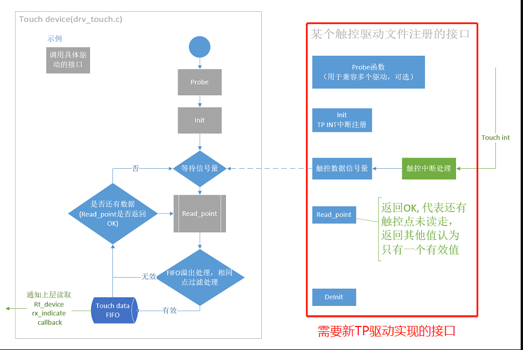

<br/>
<br/>
<br/>
<br/>

### TP驱动注册到系统的接口
在gt911.c中通过INIT_COMPONENT_EXPORT注册初始化函数rt_tp_device_init，然后在rt_tp_device_init里面通过函数rt_touch_drivers_register，将TP驱动注册到系统。

```c
static struct touch_drivers driver;

static struct touch_ops ops =
{
    read_point, //TP数据读取回调函数
    init,       //TP初始化回调函数
    deinit      //TP去初始化回调函数
};


static int rt_tp_device_init(void)
{

    driver.probe = probe;  //TP在位检测回调函数
    driver.ops = &ops;
    driver.user_data = RT_NULL;
    driver.isr_sem = rt_sem_create("gt911", 0, RT_IPC_FLAG_FIFO); //TP数据读取信号量

    rt_touch_drivers_register(&driver);  //注册到系统TP驱动框架
    return 0;

}
INIT_COMPONENT_EXPORT(rt_tp_device_init); //注册初始化函数
```


## 背光部分
非自发光的屏幕一般需要背光，目前屏幕的背光驱动都通过各种办法，实现了一个“lcdlight”的rt_device设备，然后统一在屏驱的回调函数[LCD_SetBrightness](lcd-cb-func-LCD-SetBrightness)内使用。

目前支持2种模式：
- PWM直驱背光，芯片直接输出PWM波形，直驱背光
- 外部背光驱动， 通过GPIO控制外部背光驱动芯片输出PWM波形，来驱动背光


### PWM直驱背光
  这种设备已经在drv_lcd.c里面注册了“lcdlight”的rt_device设备，见rt_hw_lcd_backlight_init函数。

  使用的PWM频率默认是1KHz。

  里面会用到2个宏`LCD_PWM_BACKLIGHT_INTERFACE_NAME`和`LCD_PWM_BACKLIGHT_CHANEL_NUM`，分别指定了PWM的设备名称和channel号，这2个宏一般在[Kconfig.board](lcd_driver_folder_strcuture)里面定义。

  注意：需要在menuconfig里面使能`LCD_PWM_BACKLIGHT_INTERFACE_NAME`指定的pwm rt_device，例如指定"pwm2"时需要选择：
  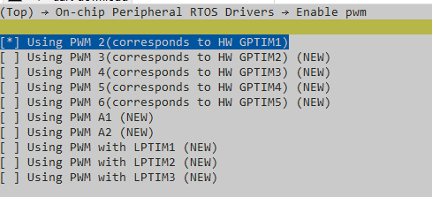

  通过在屏幕模组里面选择宏[LCD_USING_PWM_AS_BACKLIGHT](lcd_menuconfig_select_backlight_type)来使用这种类型的背光。

### 外部背光驱动
   例如aw9364.c，是在sif_aw9364_init函数里面注册的“lcdlight”的rt_device设备。

   里面宏`LCD_BACKLIGHT_CONTROL_PIN`来指定使用哪个GPIO来控制aw9364。这个宏也在[Kconfig.board](lcd_driver_folder_strcuture)里面定义。


   通过在屏幕模组里面选择宏[BL_USING_AW9364](lcd_menuconfig_select_backlight_type)来使用这种类型的背光。


<!--


----

## LCD&TP工程的通用设置
通常一个硬件PCB对应一个工程，一个工程同时可以兼容多个LCD&TP模组，这些模组使用相同的硬件接口相连，所以我们将这些和具体模组无关的LCD&TP配置放在这里说明。

这些通用配置为所有的LCD&TP驱动提供板级IO的API和宏定义：

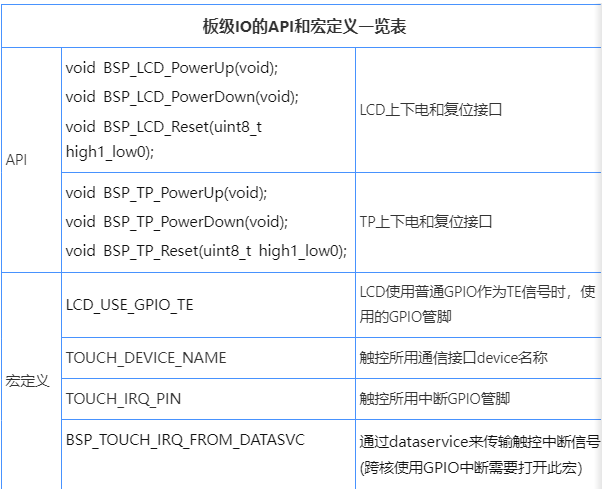

此处以ec-lb555xxx系列EVB为例

SDKrelease\drivers\boards\ec-lb555xxx\drv_io.c 板级API接口提供
SDKrelease\drivers\boards\ec-lb555xxx\pinmux.c 板级pinmux定义文件

### 屏幕的通用设置
1. 上电

SDK1.0.4以前的版本，开机或睡眠唤醒, 跟随IO的上电一起上电

SDK1.0.4以及之后的版本，上电在LCD device内部

2. 下电


3. 复位


4. PINMUX


5. 屏幕的TE的板级配置

屏幕的TE需要打通硬件信号，接口有3种：
1. DSI接口的屏幕TE信号支持走DSI总线，不需要额外的线
2. SPI/8080等接口,  只需要将TE脚的pinmux设置成TE管脚
3. 前2种方案硬件上都不支持的情况下，可以用任意GPIO作为TE信号，这种方法TE是靠GPIO的ISR中断，实时性稍差。

上述几种TE的工作机制：
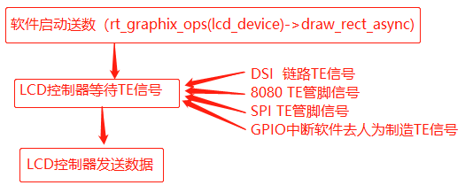
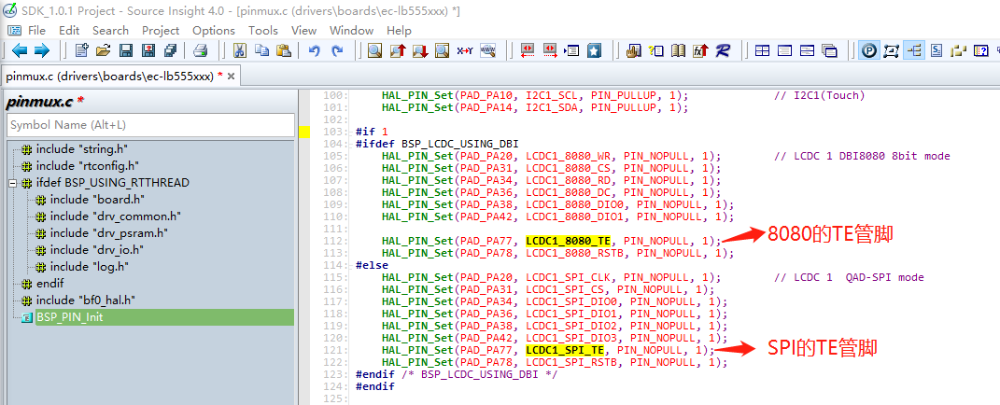
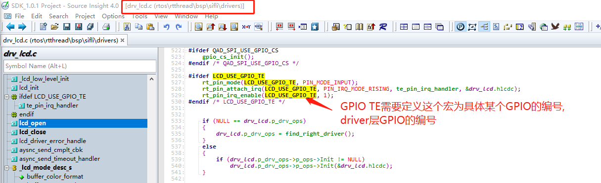


### 触控的通用设置

#### 1. TOUCH_DEVICE_NAME

触控的通信接口rt-device名称，可以是I2C或者SPI接口，具体通信接口调用在驱动内部
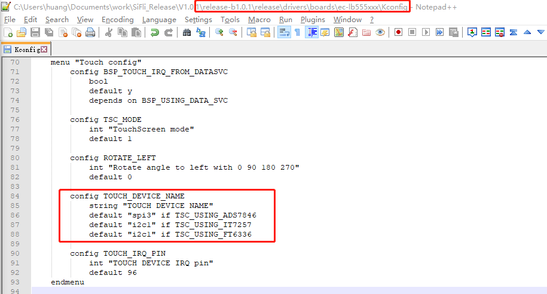

#### 2. 上电

SDK1.0.4以前的版本，开机或睡眠唤醒, 跟随IO的上电一起上电
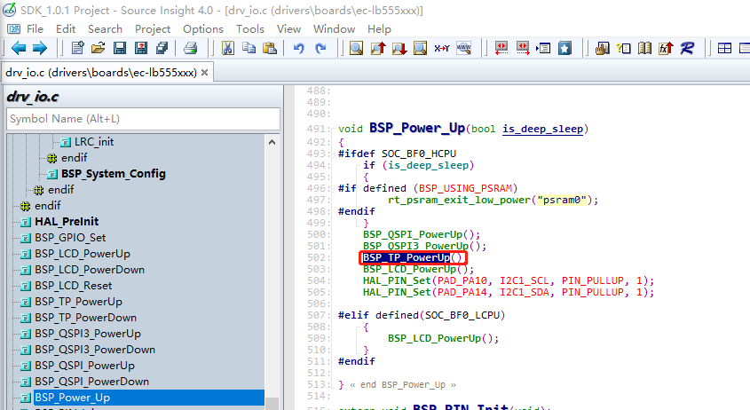

SDK1.0.4以及之后的版本，上电在Touch device内部

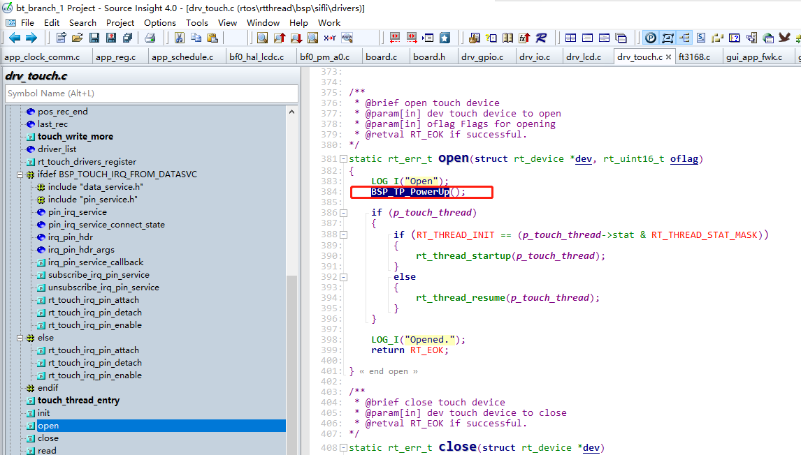

#### 3.下电

SDK1.0.4以前的版本，关机或睡眠跟随IO一起下电
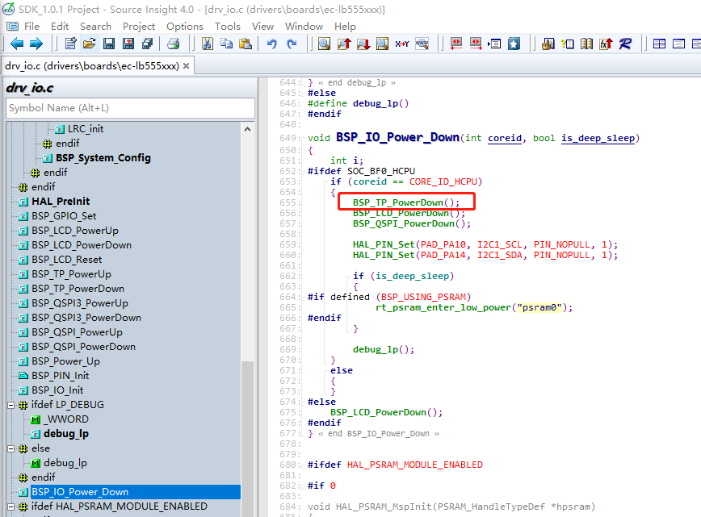

SDK1.0.4以及之后的版本，下电在Touch device内部
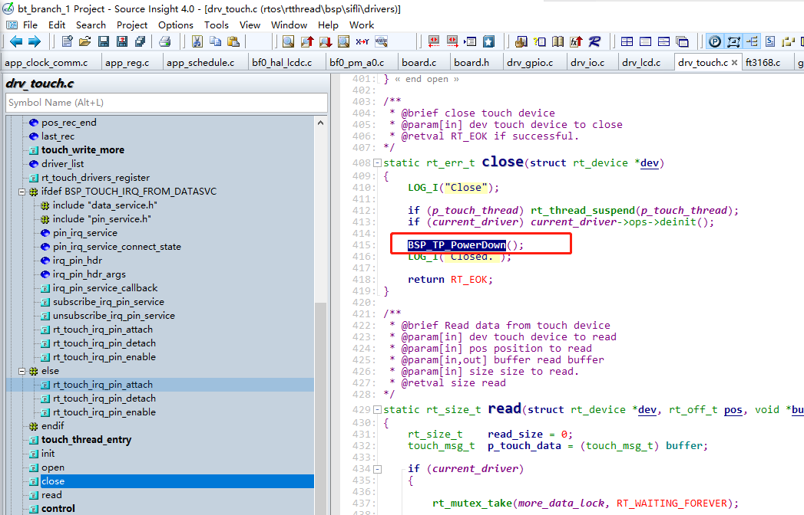

#### 4.复位

SDK1.0.4以前的版本很多没有调用复位接口，之后的版本如果触控有需要可以在驱动内部probe函数和init函数的头部加上reset
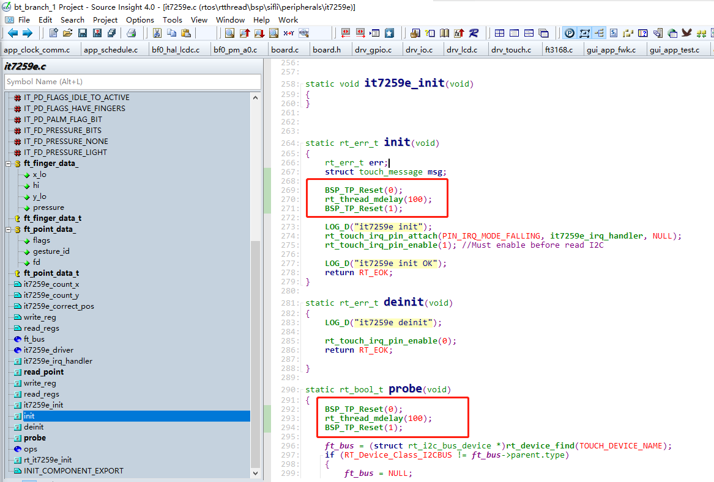

#### 5.中断

TOUCH_IRQ_PIN  - 触控所用中断GPIO管脚
BSP_TOUCH_IRQ_FROM_DATASVC  - 如果触控中断GPIO是使用跨核的pin，需要打开此宏
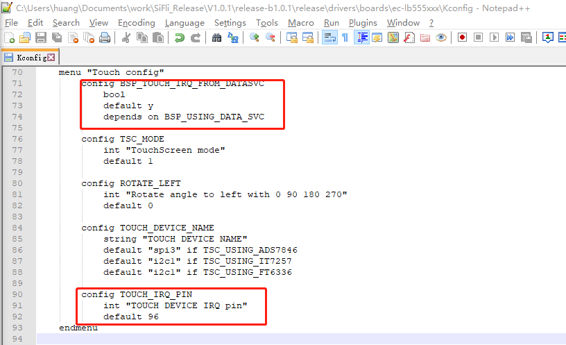


### 调试工程选择

SDKrelease\example\rt_driver工程是一个专门用来调试rt_driver设备的工程，其中我们为LCD提供了一个显示变色矩形区域的示例：
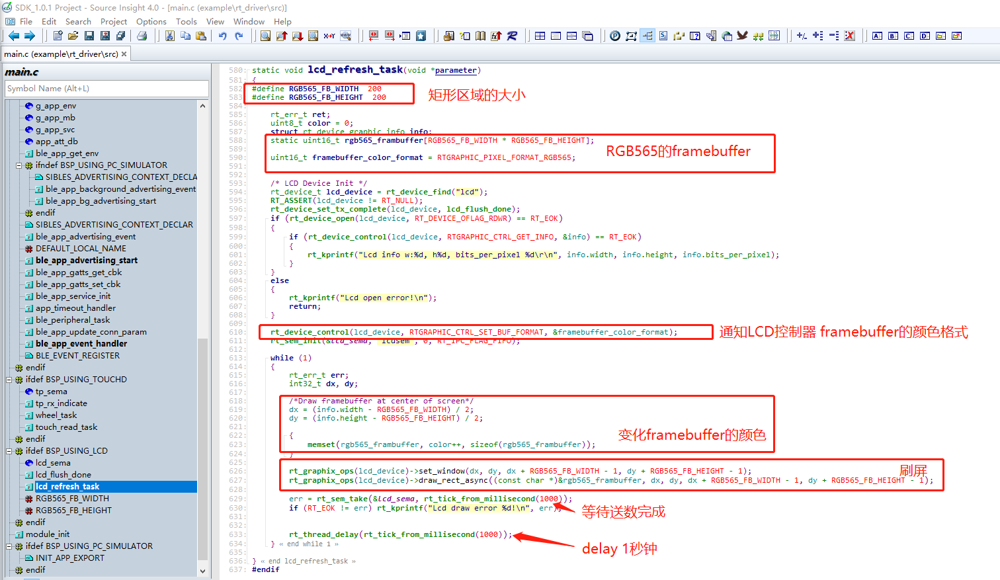

并且为触控增加了一个读取触控并打印的线程：

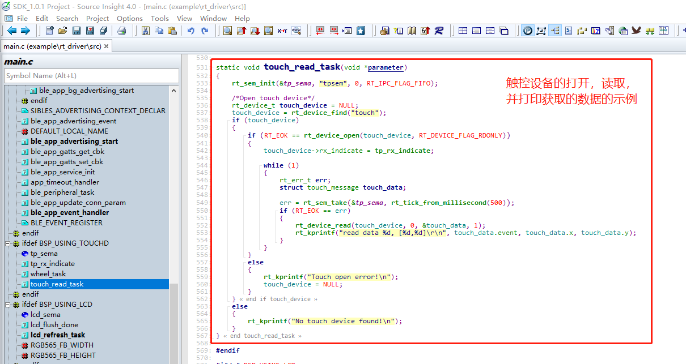

当前示例中我们选择ec-lb555工程
SDKrelease\example\rt_driver\project\ec-lb555
工程编译烧写后开机直接刷屏和读取触控数据

*建议客户屏幕点亮后，将framebuffer换成全屏的图片再检查一遍,  确保不存在偏移、颜色格式、超出液晶玻璃范围等问题。

显示一张图片的示例：
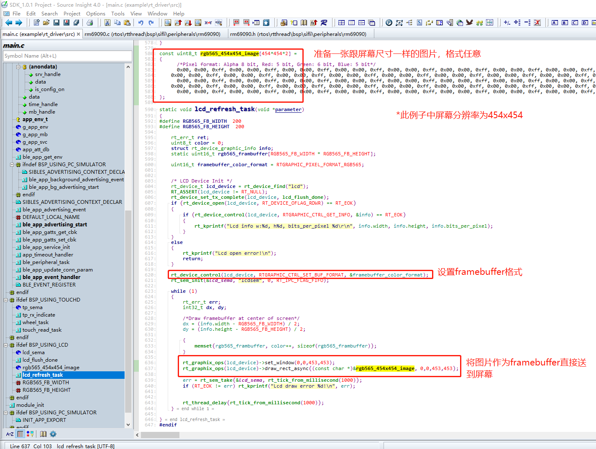


-->